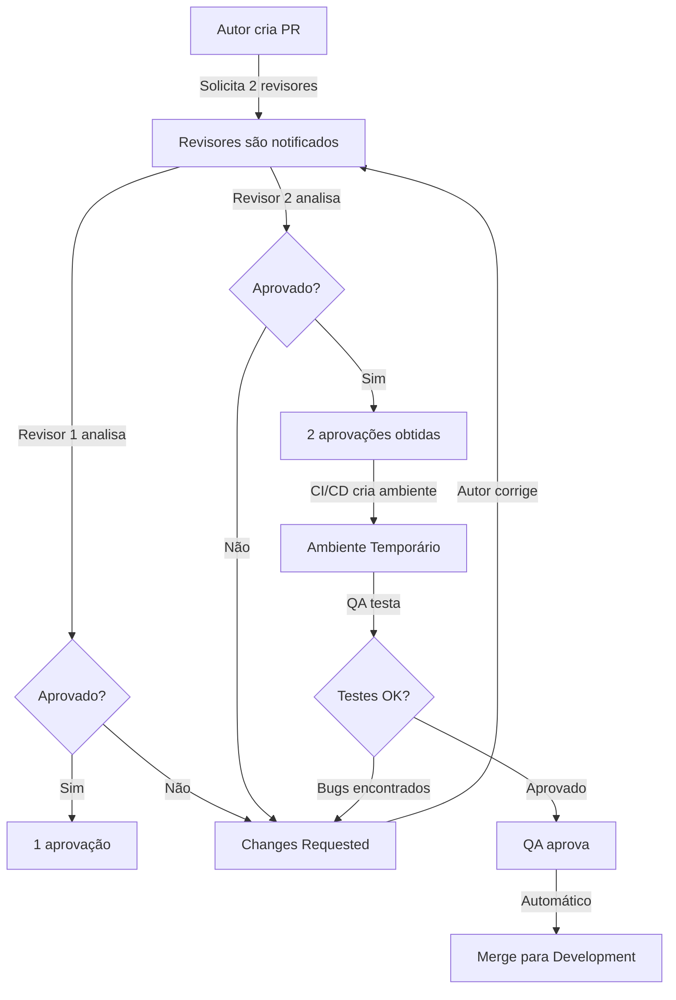

# Code Review - Guia Completo da Berry

## 1. Introdução

### 1.1 Objetivo do Documento

Este documento estabelece o processo de **Code Review (revisão de código)** na Berry, detalhando responsabilidades, boas práticas e expectativas para autores e revisores de Pull Requests. O code review é uma etapa crítica do nosso processo de desenvolvimento que assegura qualidade técnica, compartilhamento de conhecimento e consistência no código.

### 1.2 Importância do Code Review

O code review não é apenas uma barreira de qualidade, mas uma ferramenta de:

- **Qualidade de Código**: Identificar bugs, vulnerabilidades e problemas de performance antes de produção
- **Compartilhamento de Conhecimento**: Disseminar padrões e técnicas entre o time
- **Consistência**: Manter padrões de código alinhados com o CLAUDE.md
- **Mentoria**: Desenvolvedores plenos/seniores orientando juniores
- **Documentação Viva**: Discussões documentam decisões técnicas
- **Redução de Débito Técnico**: Prevenir atalhos que comprometem manutenibilidade

### 1.3 Princípios Fundamentais

**Respeito e Colaboração**: Code review é uma conversa técnica entre profissionais. Não é sobre ego ou hierarquia, mas sobre construir o melhor produto possível.

**Aprendizado Contínuo**: Todos têm algo a aprender e ensinar. Juniores trazem perspectivas novas, seniores compartilham experiência.

**Eficiência**: Reviews rápidos mantêm o fluxo de desenvolvimento. Meta: revisar PRs em até **4 horas**.

---

## 2. Processo de Code Review

### 2.1 Fluxo Geral



### 2.2 Etapas do Processo

**Etapa 1: Code Review (Desenvolvedores)**

- Autor cria PR e solicita 2 revisores
- Revisores analisam código em até 4 horas
- Discussões técnicas e sugestões de melhorias
- **Resultado**: 2 aprovações necessárias para avançar

**Etapa 2: Ambiente Temporário**

- Após 2 aprovações, CI/CD cria ambiente temporário automaticamente
- Branch do PR é deployada isoladamente
- QA recebe notificação para iniciar testes

**Etapa 3: Validação QA**

- QA testa funcionalidade no ambiente temporário
- Valida critérios de aceitação da tarefa
- Testa edge cases e fluxos alternativos
- **Resultado**: Aprovação ou reporte de bugs

**Etapa 4: Merge Automático**

- Após aprovação do QA, merge é feito automaticamente para `development`
- Branch do PR é deletada
- Ambiente temporário é destruído

### 2.3 Pré-Requisitos para Solicitar Review

Antes de marcar PR como "Ready for Review", o autor deve:

**Checklist do Autor**

- Código compila sem erros (`pnpm lint:fix` executado)
- Testes unitários escritos e passando (`pnpm test`)
- Coverage não regrediu (mínimo 90%)
- Self-review realizado (autor revisou próprio código linha por linha)
- Descrição do PR completa (ver seção 5.4 do `git-workflow.md`)
- Screenshots/GIFs para mudanças visuais
- Branch atualizada com `development` (sem conflitos)
- CI/CD pipeline verde

### 2.4 Papéis e Responsabilidades

#### Autor do PR

- **Criar PR completo**: Título, descrição, screenshots, testes
- **Responder rapidamente**: Comentários dos revisores em até 24 horas
- **Explicar decisões**: Justificar escolhas técnicas quando questionado
- **Aceitar feedback**: Considerar sugestões com mente aberta
- **Estar disponível para QA**: Responder dúvidas durante testes
- **Corrigir bugs rapidamente**: Se QA encontrar problemas
- **Autoridade final**: Decidir quais mudanças aplicar (após discussão)

#### Revisor do PR

- **Revisar em até 4 horas**: Manter fluxo de desenvolvimento
- **Entender contexto**: Ler descrição do PR e tarefa relacionada
- **Fazer perguntas**: Buscar entendimento antes de criticar
- **Sugerir, não impor**: Oferecer alternativas, não exigir mudanças
- **Aprovar rapidamente**: Se código está bom, não ser bloqueador
- **Aguardar QA**: Aprovação do revisor não significa merge imediato

#### QA

- **Testar em até 24 horas**: Após ambiente temporário estar disponível
- **Validar critérios de aceitação**: Conferir se tarefa foi completada
- **Reportar bugs claramente**: Passos para reproduzir, screenshots, severidade
- **Aprovar quando OK**: Disparar merge automático

#### Tech Lead

- **Supervisionar qualidade**: Revisar PRs críticos ou complexos
- **Resolver impasses**: Mediar quando autor e revisor discordam
- **Manter padrões**: Assegurar aderência ao CLAUDE.md
- **Mentoria**: Orientar time em decisões arquiteturais

---

## 3. Diretrizes para Todos

### 3.1 Comunicação Respeitosa e Construtiva

**Faça perguntas ao invés de afirmações**

```diff
- ❌ "Este nome de variável está errado."
+ ✅ "O que você acha de renomear `data` para `dealAnalysisResult`?"
```

**Evite linguagem pessoal**

```diff
- ❌ "Você não entendeu o padrão do projeto."
+ ✅ "Este padrão difere do nosso CLAUDE.md. Podemos alinhar?"
```

**Use linguagem neutra**

```diff
- ❌ "Esse código é horrível e confuso."
+ ✅ "Esta lógica está complexa. Podemos refatorar em funções menores?"
```

**Assuma boa intenção**

```diff
- ❌ "Por que você não escreveu testes?"
+ ✅ "Vi que faltaram testes. Precisa de ajuda para escrever?"
```

### 3.2 Quando Escalar para Discussão Síncrona

Se comentários no PR não estão resolvendo:

**Sinais de que precisa conversar ao vivo**:

- Mais de 3 rounds de comentários sobre o mesmo ponto
- Mal-entendidos repetidos
- Discussão arquitetural complexa
- Emoções estão aflorando

**Como escalar**:

```markdown
Acho que estamos tendo dificuldade de alinhar por texto. Que tal uma call rápida de 15min para discutir? Estou disponível hoje às 14h ou 16h.
```

---

## 4. Responsabilidades do Autor do PR

### 4.1 Antes de Solicitar Review

**1. Self-Review Completo**

- Leia seu próprio código linha por linha como se fosse outra pessoa
- Adicione comentários explicando decisões não óbvias
- Corrija problemas óbvios antes de pedir review
- Verifique se código segue padrões do CLAUDE.md

**2. Descrição Completa do PR**

Siga o template da seção 5.4 do `git-workflow.md`:

```markdown
## O que foi feito (What)

Implementa análise automática de leads usando GPT-4o-mini.

## Por que foi feito (Why)

Para automatizar qualificação de leads e reduzir tempo do BDR.

## Como foi feito (How)

- Criado LeadAnalysisService com integração OpenAI
- Cache de 15 minutos para reduzir custos
- Validação de input com Zod

## Passos para testar

1. Criar lead via formulário de contato
2. Verificar que score foi calculado automaticamente
3. Conferir análise detalhada na aba "Análise IA"

## Critérios de aceitação

- [ ] Lead recebe score de 1-5 automaticamente
- [ ] Análise detalhada aparece na interface
- [ ] Cache funciona (2ª análise do mesmo lead é instantânea)
- [ ] Erros da API são tratados gracefully

## Screenshots

[Anexar imagens]
```

**3. Testes Completos**

- Execute `pnpm lint:fix`
- Execute `pnpm test:coverage`
- Teste manualmente os fluxos principais
- Verifique que CI/CD está verde

### 4.2 Durante o Review

**Responda Todos os Comentários**

Mesmo que seja apenas:
- "Corrigido no commit abc123"
- "Boa observação, ajustei"
- "Discordamos por motivo X, vamos escalar?"

**Agradeça Feedback**

```markdown
Ótima observação! Não tinha pensado nesse edge case. Obrigado!
```

**Explique Suas Decisões**

```markdown
Escolhi usar `useState` ao invés de `useObservable` aqui porque este estado não precisa ser reativo globalmente, é apenas local do componente.
```

**Marque Comentários como Resolvidos**

Após corrigir, clique em "Resolve conversation" no GitHub.

### 4.3 Respondendo a Feedback

**Quando Concordar com Sugestão**

```markdown
Faz muito sentido! Vou refatorar para usar DataLoader.

Commit: abc1234
```

**Quando Discordar Respeitosamente**

```markdown
Entendo sua preocupação, mas acredito que a abordagem atual é mais simples porque:

1. Não precisamos de cache global aqui
2. Performance não é crítica (roda 1x por dia)
3. Facilita testes unitários

O que você acha? Se ainda achar importante, podemos escalar para @tech-lead.
```

**Quando Não Entender**

```markdown
Não entendi bem sua sugestão. Pode explicar melhor ou dar um exemplo de código?
```

### 4.4 Quando Discordar do Revisor

**Passo 1**: Explique seu raciocínio

**Passo 2**: Ouça o raciocínio do revisor

**Passo 3**: Se impasse persistir, escale para Tech Lead

```markdown
@tech-lead Temos visões diferentes sobre usar abordagem A vs B aqui.

**Contexto**: [explicação breve]

**Abordagem A** (atual): [pros e cons]
**Abordagem B** (sugestão): [pros e cons]

Pode nos ajudar a decidir?
```

### 4.5 Acompanhamento do QA

**Quando QA Iniciar Testes**

- Fique disponível no Slack para dúvidas
- Responda rapidamente se QA não entender algo
- Não inicie nova tarefa até QA aprovar (para não perder contexto)

**Quando QA Reportar Bug**

1. Agradeça o reporte
2. Reproduza o bug localmente
3. Corrija rapidamente
4. Notifique QA para re-testar
5. **Importante**: Correções pequenas não precisam de nova aprovação dos revisores, apenas re-teste do QA

**Exemplo de Resposta**:

```markdown
Obrigado por reportar, @qa!

Reproduzi o bug: filtro não funciona quando há acentos.

**Correção**: Adicionei normalização de strings no filtro.

**Commit**: def5678

Pode re-testar quando possível? Agora deve funcionar com "José", "María", etc.
```

---

## 5. Responsabilidades do Revisor

### 5.1 O Que Revisar

#### Checklist de Revisão

**Funcionalidade**

- O código faz o que a tarefa descreve?
- Todos os critérios de aceitação foram atendidos?
- Edge cases estão cobertos?
- Erros são tratados adequadamente?

**Qualidade de Código**

- Código é legível e simples?
- Nomes de variáveis/funções são descritivos?
- Funções são pequenas e focadas (< 50 linhas)?
- Lógica complexa está comentada?
- Não há código duplicado?

**Aderência aos Padrões**

- Segue padrões do CLAUDE.md?
- Usa TypeScript com tipos explícitos?
- Imports usam `@app/*` aliases?
- **Backend**:
  - AQL queries otimizadas?
  - Eventos emitidos corretamente (`service.create()` ao invés de `createSilently()`)?
  - Listeners registrados se necessário?
- **Frontend**:
  - Usa `observer` wrapper?
  - Usa `useObservable` ao invés de `useState`?
  - Usa shadcn/ui components?
  - Sufixo `$` em variáveis de estado?

**Testes**

- Testes unitários escritos para lógica crítica?
- Testes cobrem casos de sucesso e falha?
- Mocks usam padrões de `infra/test` quando possível?
- Coverage está acima de 90%?

**Performance**

- Queries de banco otimizadas (índices usados)?
- Cache implementado onde apropriado?
- Não há N+1 queries?
- Componentes React não re-renderizam desnecessariamente?

**Segurança**

- Inputs de usuário são validados (Zod)?
- Dados sensíveis não estão expostos em logs?
- Permissões estão corretas (shield, workspace isolation)?
- SQL/AQL injection prevenido?

**UX/UI (Frontend)**

- Interface é intuitiva?
- Mensagens de erro são claras?
- Loading states implementados?
- Responsivo (mobile + desktop)?
- Dark mode funciona corretamente?

### 5.2 Como Dar Feedback Efetivo

**Seja Específico**

```diff
- ❌ "Melhore a performance aqui."
+ ✅ "Este loop está rodando O(n²). Que tal usar um Map para O(n)?"
```

**Ofereça Alternativas**

```diff
- ❌ "Esta abordagem não funciona."
+ ✅ "Que tal usar `useMemo` aqui ao invés de recalcular em cada render?"
```

**Explique o "Por Quê"**

```diff
- ❌ "Use `isNotEmptyValue` aqui."
+ ✅ "Use `isNotEmptyValue` pois ele cobre `null`, `undefined` e `''` de forma consistente."
```

**Reconheça o Bom Trabalho**

```markdown
Gostei da forma como você estruturou esses testes! Muito claro.

Essa refatoração deixou o código muito mais legível. Bom trabalho!
```

### 5.3 Níveis de Severidade

Classifique a importância do feedback:

**[Bloqueador]** - Deve ser corrigido antes de QA testar

```markdown
**[Bloqueador]** Esta query está causando N+1. Precisa usar DataLoader.
```

**[Sugestão]** - Bom ter, mas não obrigatório

```markdown
**[Sugestão]** Que tal renomear `data` para `userProfile` para mais clareza?
```

**[Nitpick]** - Preferência pessoal, autor decide

```markdown
**[Nitpick]** Eu prefiro usar `??` ao invés de `||` aqui, mas ambos funcionam.
```

**[Pergunta]** - Busca entendimento, não é crítica

```markdown
**[Pergunta]** Por que optou por usar `useState` ao invés de `useObservable` aqui?
```

### 5.4 Quando Aprovar vs Request Changes

**Aprovar** quando:

- Não há problemas bloqueadores
- Sugestões são opcionais
- Código atende critérios de qualidade mínimos
- Pequenas melhorias podem ser feitas depois

**Request Changes** quando:

- Há bugs ou problemas de lógica
- Faltam testes críticos
- Segurança está comprometida
- Padrões do CLAUDE.md não foram seguidos
- Performance é inaceitável

**Comentar (sem aprovar/rejeitar)** quando:

- Tem dúvidas sobre abordagem mas não é bloqueador
- Quer discutir alternativas
- Está aprendendo com o código

### 5.5 Após Aprovação

**Importante**: Sua aprovação não significa que PR vai para produção imediatamente.

**Fluxo após 2 aprovações**:

1. Ambiente temporário é criado automaticamente
2. QA testa funcionalidade
3. Se QA encontrar bugs, autor corrige
4. Pequenas correções **não precisam** de nova aprovação sua
5. Apenas se arquitetura mudar significamente, QA deve solicitar nova revisão

**O que fazer se QA encontrar bugs**:

- Acompanhe thread do PR
- Se correção mudar lógica significamente, revise novamente
- Se for fix simples (typo, ajuste de CSS), confie no QA

---

## 6. Integração com QA

### 6.1 Ambiente Temporário

**Como Funciona**:

- Após **2 aprovações de desenvolvedores**, CI/CD cria automaticamente um ambiente isolado
- Branch do PR é deployada com URL única (ex: `pr-123.staging.berry.com`)
- QA recebe notificação com link do ambiente
- Ambiente fica ativo até merge ou fechamento do PR

**Vantagens**:

- QA testa código real, não apenas na máquina do desenvolvedor
- Testes não afetam ambiente de desenvolvimento compartilhado
- Fácil compartilhar com stakeholders para validação

### 6.2 Responsabilidades do Autor Durante Testes

**Estar Disponível**

- Não inicie nova tarefa complexa até QA validar
- Responda dúvidas no Slack rapidamente
- Explique fluxos que não estão óbvios

**Fornecer Dados de Teste**

Se necessário, crie dados de exemplo no ambiente temporário:

```markdown
**Dados de teste criados no ambiente**:

- Usuário: qa-test@berry.com / senha: Test123!
- Deal: DEAL-999 (status MQL)
- Organização: "Empresa Teste LTDA"
```

**Monitorar Logs**

- Acompanhe logs do ambiente temporário
- Se QA reportar erro, já tenha contexto do que aconteceu

### 6.3 O Que Fazer Quando QA Encontra Bugs

**Passo 1: Agradecer e Confirmar**

```markdown
Obrigado por reportar, @qa-member! Vou investigar.
```

**Passo 2: Reproduzir Localmente**

- Clone os passos do QA
- Confirme que consegue reproduzir o bug
- Se não conseguir, peça mais detalhes

**Passo 3: Corrigir e Commitar**

```bash
# Fazer correção
git add .
git commit -m "[MAIA-45]: fix: corrige filtro com caracteres especiais"
git push origin MAIA-45
```

**Passo 4: Notificar QA**

```markdown
Bug corrigido!

**Problema**: Filtro não tratava acentuação.
**Solução**: Adicionei normalização de strings.
**Commit**: abc1234

Ambiente temporário já foi atualizado automaticamente. Pode re-testar quando possível! 🙏
```

### 6.4 Fluxo: Bug → Correção → Re-teste

**Correções Pequenas** (typos, ajustes de CSS, validações):

- Autor corrige
- QA re-testa
- **Não precisa** de nova aprovação de revisores
- QA aprova → merge automático

**Correções Grandes** (mudança de lógica, refatoração):

- Autor corrige
- Autor notifica revisores: "Precisei mudar a abordagem, podem revisar novamente?"
- Revisores aprovam novamente
- QA testa
- QA aprova → merge automático

**Exemplo de Correção Grande**:

```markdown
@reviewer1 @reviewer2

Precisei mudar significativamente a lógica após feedback do QA.

**Mudança**: Ao invés de calcular score no frontend, movemos para backend para garantir consistência.

**Arquivos afetados**:
- `src/maia/lead-score.service.ts` (novo)
- `src/modules/deal/deal-analysis.tsx` (refatorado)

Podem revisar novamente? Obrigado!
```

---

## 7. Boas Práticas e Anti-Patterns

### 7.1 Boas Práticas

#### Para Autores

✅ **Self-review antes de solicitar**: Revise seu próprio PR linha por linha antes de marcar como "Ready for Review"

✅ **Mantenha PRs pequenos**: < 400 linhas alteradas (exclui testes e configs gerados)

✅ **Explique decisões não óbvias**: Comentários no código ou na descrição do PR

✅ **Responda todos os comentários**: Mesmo que seja "Corrigido" ou "Discordamos por X motivo"

✅ **Agradeça feedback**: "Boa observação!" ou "Não tinha pensado nisso, obrigado!"

✅ **Separe feedback dos commits originais**: Não faça squash até ter todas as aprovações

✅ **Teste localmente**: Rode build, lint, testes antes de pedir review

✅ **Fique disponível durante QA**: Responda dúvidas rapidamente

#### Para Revisores

✅ **Revise em até 4 horas**: Evite bloquear o fluxo do autor

✅ **Leia a descrição do PR primeiro**: Entenda o contexto antes de ver o código

✅ **Faça perguntas**: "Por que escolheu esta abordagem?" ao invés de "Mude para X"

✅ **Teste o código**: Faça checkout da branch e rode localmente para mudanças complexas

✅ **Aprove explicitamente**: Clique em "Approve" no GitHub e comente "LGTM" ou "Ready to merge"

✅ **Ofereça aprender**: "Não conhecia esta técnica. Pode me explicar melhor?"

✅ **Balanceie rigor e pragmatismo**: Perfeição é inimiga do progresso

✅ **Confie no QA**: Sua aprovação + QA = código pronto para produção

#### Para QA

✅ **Teste em até 24 horas**: Manter fluxo rápido

✅ **Siga critérios de aceitação**: Use tarefa como checklist

✅ **Reporte bugs claramente**: Passos para reproduzir, screenshots, severidade

✅ **Teste edge cases**: Não apenas fluxo feliz

✅ **Comunique início dos testes**: "Iniciando testes do PR #123"

### 7.2 Anti-Patterns

#### Para Autores

❌ **PRs gigantes**: > 1000 linhas misturando múltiplas features

❌ **Descrição vazia**: Apenas "implementa feature X" sem detalhes

❌ **Ignorar feedback**: Marcar como "Resolved" sem implementar mudança

❌ **Defender ego**: Levar críticas como pessoais ao invés de técnicas

❌ **Commits WIP**: Deixar commits "WIP", "teste", "fix" no PR final

❌ **Solicitar review antes de CI passar**: Desperdiçar tempo do revisor

❌ **Sumir durante QA**: Não responder dúvidas do QA

#### Para Revisores

❌ **Demorar dias**: Deixar PR sem feedback por 24+ horas sem justificativa

❌ **Aprovar sem ler**: "LGTM" sem realmente ter revisado o código

❌ **Ser rude**: "Que código horrível" ou "Você não sabe TypeScript?"

❌ **Reescrever o PR**: Fazer 50 comentários para mudar tudo ao seu estilo

❌ **Nitpicks bloqueadores**: Exigir mudança de `,` para `;` como bloqueador

❌ **Debates teóricos**: Discutir filosofia de programação por 2 horas nos comentários

❌ **Falta de contexto**: Comentar sem entender o requisito de negócio

#### Para QA

❌ **Testar superficialmente**: Apenas fluxo feliz, ignorar edge cases

❌ **Reportar bugs vagos**: "Não funciona" sem passos para reproduzir

❌ **Demorar semanas**: Deixar PR parado aguardando testes

❌ **Aprovar sem testar**: Confiar que "deve estar funcionando"

---

## 8. Cenários Especiais

### 8.1 Reviews de Juniores para Seniores

Quando um desenvolvedor junior está revisando código de um pleno/senior:

**Não tenha medo de perguntar**

```markdown
**[Pergunta]** Não entendi esta parte. Pode explicar o que esta função faz?
```

**Aproveite para aprender**

```markdown
Legal essa técnica de usar DataLoader! Não conhecia. Obrigado por usar.
```

**Valide seu entendimento**

```markdown
Se entendi certo, este código faz X para resolver Y. Está correto?
```

**Não se intimide**

- Seniores também cometem erros
- Sua perspectiva fresca é valiosa
- Perguntar "bobagens" ajuda documentar decisões

### 8.2 Reviews de Seniores para Juniores (Mentoria)

Quando um pleno/senior está revisando código de um junior:

**Seja paciente e didático**

```markdown
**[Sugestão]** Vejo que você usou `for` loop aqui. No TypeScript, `map()` é mais idiomático:

**Antes**:
```typescript
const names = [];
for (const user of users) {
  names.push(user.name);
}
```

**Depois**:
```typescript
const names = users.map(user => user.name);
```

**Por quê?**: Mais conciso, funcional, menos mutação de estado.

**Referência**: [MDN - Array.map()](https://developer.mozilla.org/en-US/docs/Web/JavaScript/Reference/Global_Objects/Array/map)
```

**Ofereça mentoria**

```markdown
Vejo que você está desenvolvendo bem! Se quiser, podemos fazer uma call de 30min para eu explicar melhor o padrão de Services do projeto.
```

**Reconheça progresso**

```markdown
Seus testes estão muito melhores que no PR anterior! Continue assim! 🚀
```

**Explique o "bigger picture"**

```markdown
Essa decisão de usar cache aqui vai impactar performance de toda a aplicação porque este service é chamado em vários lugares. Por isso é importante acertar.
```

### 8.3 Hotfixes Urgentes (FIX-XXX)

Para `FIX-XXX` branches (bugs críticos em produção):

**Processo Simplificado**:

- **1 aprovação suficiente** (ao invés de 2)
- **Review em até 1 hora** (ao invés de 4 horas)
- **Tech Lead é revisor obrigatório**: Sempre incluir Tech Lead no review
- **Foco em correção, não perfeição**: Priorize resolver o problema
- **QA testa rapidamente**: Validação express, não completa
- **Ambiente temporário opcional**: Pode pular em casos extremos

**Após Hotfix**:

Criar issue para melhorias:

```markdown
[BRY-XXX] Refatorar lógica do hotfix FIX-89

**Contexto**: Hotfix FIX-89 resolveu bug crítico mas código pode ser melhorado.

**Tarefas**:
- [ ] Adicionar testes unitários
- [ ] Refatorar função X para melhor legibilidade
- [ ] Adicionar documentação
- [ ] Revisar se solução pode ser mais robusta
```

### 8.4 Quando Autor e Revisor Discordam

Se após discussão racional há impasse:

**Passo 1**: Tente entender perspectivas

```markdown
**Autor**: "Prefiro abordagem A porque é mais simples de entender."
**Revisor**: "Entendo, mas abordagem B tem melhor performance."
```

**Passo 2**: Considere trade-offs

- Simplicidade vs Performance
- Tempo de implementação vs Qualidade
- Padrão do projeto vs Inovação

**Passo 3**: Escalar para Tech Lead

```markdown
@tech-lead Precisamos de uma decisão aqui.

**Contexto**: Implementação de cache para análise de leads.

**Abordagem A** (atual - in-memory):
- Prós: Simples, rápido de implementar
- Contras: Perde cache em restart, não escala horizontalmente

**Abordagem B** (sugestão - Redis):
- Prós: Persistente, escalável
- Contras: Complexidade adicional, dependência externa

**Prazo**: Tarefa precisa estar pronta até sexta.

Pode nos ajudar a decidir?
```

**Decisão Final**: Tech Lead decide baseado em:

- Prioridades do projeto (prazo vs qualidade)
- Padrões estabelecidos
- Impacto de longo prazo
- Contexto de negócio

### 8.5 PRs de Dependências (Dependabot)

PRs automáticos de atualização de dependências:

**Checklist Simplificado**:

- CI/CD passou?
- Mudanças são apenas de versão (sem código)?
- CHANGELOG da lib não tem breaking changes?
- Aplicação roda localmente?

**Se sim para todos**: Aprovação rápida (1 revisor suficiente)

**Se breaking changes**: Investigar e ajustar código

**QA**: Testes de regressão básicos (smoke tests)

---

## 9. Ferramentas e Automação

### 9.1 GitHub Features

**Draft PRs**: Use para PRs em progresso que ainda não estão prontos para review

```bash
# Criar PR como draft
gh pr create --draft --title "[WIP] MAIA-45: análise de leads"

# Marcar como ready
gh pr ready 123
```

**Request Changes**: Use quando houver problemas bloqueadores

```markdown
**Status**: Request Changes

**Motivo**: Faltam testes unitários para a lógica crítica de cálculo de CAC.
```

**Approve**: Use quando PR está pronto para QA

```markdown
**Status**: Approved ✅

Código está limpo e testes cobrem os casos principais. Ready para QA!
```

**Comments**: Use para discussões não bloqueadoras

```markdown
**[Sugestão]** Este nome poderia ser mais descritivo, mas não bloqueia.
```

### 9.2 GitHub CLI para Reviews

```bash
# Listar PRs pendentes de review
gh pr list --search "review-requested:@me"

# Ver diff de um PR
gh pr diff 123

# Fazer checkout local de um PR
gh pr checkout 123

# Aprovar PR
gh pr review 123 --approve --body "LGTM! Testes passaram e código está limpo."

# Solicitar mudanças
gh pr review 123 --request-changes --body "Faltam testes para o caso X."

# Comentar sem aprovar/rejeitar
gh pr review 123 --comment --body "Considere usar DataLoader aqui."
```

### 9.3 Ambientes Temporários

**Como São Criados**:

- Trigger automático após 2 aprovações
- GitHub Actions executa workflow de deploy
- Branch é deployada em infraestrutura isolada
- URL única é gerada (ex: `pr-123.staging.berry.com`)
- Notificação enviada para QA com link

**Como São Destruídos**:

- Automaticamente após merge
- Automaticamente após fechar PR sem merge
- Manualmente via GitHub Actions (se necessário)

**Acessar Logs**:

```bash
# Ver logs do ambiente temporário do PR 123
gh run list --workflow=deploy-pr --limit=1
gh run view 12345 --log
```

### 9.4 Automações Futuras

**Danger.js** (planejado):

```javascript
// Avisar se PR é muito grande
if (danger.github.pr.additions > 500) {
  warn('Este PR tem mais de 500 linhas. Considere dividir em PRs menores.');
}

// Checar se tem testes
const hasTests = danger.git.modified_files.some(f => f.includes('.test.'));
if (!hasTests) {
  warn('Este PR não adiciona testes. Tem certeza que não precisa?');
}

// Checar se descrição está completa
if (danger.github.pr.body.length < 50) {
  fail('Descrição do PR está muito curta. Preencha o template completo.');
}
```

---

## 10. Exemplos Práticos

### 10.1 Exemplo Completo: Review de Feature Backend

**PR**: `[MAIA-45]: feat: implementa análise de leads com IA`

**Comentários do Revisor**:

```markdown
## Revisão Geral

Ótimo trabalho! A feature está funcional e testes cobrem os casos principais. Alguns pontos para melhorar:

---

### Comentários

#### `src/maia/lead-analysis.service.ts:23`

**[Sugestão]** Cache de 1 hora pode ser muito para leads que mudam frequentemente.

**Atual**:
```typescript
@cache({ ttl: 60 * 60 * 1000 })
```

**Sugerido**:
```typescript
@cache({ ttl: 15 * 60 * 1000 }) // 15 minutos
```

---

#### `src/maia/lead-analysis.service.ts:45`

**[Bloqueador]** Erro não está sendo tratado. Se API do OpenAI falhar, aplicação vai crashar.

**Problema**:
```typescript
const response = await openai.chat.completions.create(params);
return response.choices[0].message.content;
```

**Correção**:
```typescript
try {
  const response = await openai.chat.completions.create(params);
  return response.choices[0].message.content;
} catch (error) {
  logger.error('OpenAI API error', { error, dealKey });
  throw AppGraphqlError(500, 'Falha ao analisar lead. Tente novamente.');
}
```

---

#### `src/maia/lead-analysis.test.ts:12`

**[Pergunta]** Por que você escolheu mockar `openai` ao invés de usar `nock` para interceptar requests HTTP?

---

### Pontos Positivos

- Testes bem estruturados e legíveis
- Documentação dos parâmetros do prompt
- Uso correto de tipos TypeScript

---

### Checklist

- ✅ Funcionalidade implementada corretamente
- ✅ Testes cobrem casos principais
- ❌ Falta tratamento de erro (bloqueador)
- ⚠️ Cache pode ser ajustado (sugestão)
- ✅ Código segue padrões do CLAUDE.md

---

### Decisão

**Status**: Request Changes

**Ações necessárias**:
1. Adicionar try-catch na linha 45

**Ações opcionais**:
2. Ajustar TTL do cache

Após correções, me notifique para nova revisão! 👍
```

**Resposta do Autor**:

```markdown
Obrigado pela revisão detalhada! 🙏

---

#### Sobre cache (linha 23)

**Decisão**: Ajustei para 15 minutos. Faz sentido já que leads podem ser atualizados pelo BDR.

**Commit**: abc1234

---

#### Sobre erro handling (linha 45)

**Decisão**: Adicionei try-catch com log estruturado e erro amigável para usuário.

**Commit**: def5678

---

#### Sobre mocks (linha 12)

**Resposta**: Escolhi mockar `openai` diretamente porque:
1. Testes ficam mais rápidos (não precisa instanciar servidor HTTP)
2. Podemos testar comportamento da lib sem depender de rede
3. Padrão usado em `infra/test/openai.mock.ts`

Se preferir `nock`, posso mudar, mas acredito que mock direto é suficiente aqui.

---

Correções aplicadas! Pronto para nova revisão. ✅
```

**Resposta Final do Revisor**:

```markdown
Perfeito! Correções aplicadas. 👏

Sobre os mocks: sua justificativa faz sentido. Mock direto está bom!

**Status**: Approved ✅

Aguardando segunda aprovação e depois QA pode testar!
```

**Após 2 Aprovações - QA Testa**:

```markdown
**QA Report** - @qa-member

Testando no ambiente: https://pr-45.staging.berry.com

---

### Testes Realizados

✅ Lead criado via formulário recebe score automaticamente
✅ Análise detalhada aparece na aba "Análise IA"
✅ Cache funciona (2ª análise é instantânea)
❌ **Bug encontrado**: Erro ao analisar lead sem telefone

---

### Detalhes do Bug

**Passos para reproduzir**:
1. Criar lead sem preencher campo "Telefone"
2. Sistema tenta analisar
3. Erro 500 na tela

**Esperado**: Sistema deve funcionar mesmo sem telefone (campo opcional)

**Screenshot**: [anexo]

---

@autor Pode corrigir? Depois retesto!
```

**Autor Corrige**:

```markdown
Obrigado por encontrar isso, @qa-member!

**Problema**: Validação esperava telefone obrigatório.
**Solução**: Ajustei schema Zod para tornar telefone opcional.

**Commit**: ghi9012

Ambiente já está atualizado. Pode re-testar quando possível! 🙏
```

**QA Re-testa e Aprova**:

```markdown
**QA Re-test** - @qa-member

✅ Bug corrigido! Lead sem telefone funciona normalmente.
✅ Todos os critérios de aceitação atendidos.

**Status**: Aprovado para merge! 🎉
```

**Merge Automático**:

```
🤖 Merge automático realizado por GitHub Actions

Branch MAIA-45 merged into development
Environment pr-45.staging.berry.com destroyed
```

### 10.2 Exemplo Completo: Review de Feature Frontend

**PR**: `[PROJ-90]: feat: adiciona filtros avançados na lista de projetos`

**Comentários do Revisor**:

```markdown
## Revisão Geral

Interface ficou ótima! Filtros funcionam bem. Alguns ajustes:

---

### Comentários

#### `src/modules/project/project-filters.tsx:15`

**[Bloqueador]** Componente não está usando `observer`, então mudanças no `filter$` não vão re-renderizar.

**Correção**:
```typescript
export const ProjectFilters = observer(() => {
  const filter$ = useObservable({ status: [], search: '' });
  // ...
});
```

---

#### `src/modules/project/project-list.tsx:34`

**[Sugestão - Performance]** Filtro está recalculando em cada render. Use `useMemo`:

```typescript
const filteredProjects = useMemo(
  () => projects?.filter(p => matchesFilter(p, filter$.get())),
  [projects, filter$]
);
```

---

#### Screenshot da interface

Interface está linda! Dark mode funciona perfeitamente. ✨

**[Nitpick]**: Adicionar tooltip explicando o que cada filtro faz.

---

### Checklist

- ❌ Falta `observer` wrapper (bloqueador)
- ⚠️ Performance pode ser melhorada (sugestão)
- ✅ Dark mode funciona
- ✅ Responsivo

---

### Decisão

**Status**: Request Changes

**Ações necessárias**:
1. Adicionar `observer` wrapper

**Ações opcionais**:
- Adicionar `useMemo` para performance
- Adicionar tooltips

Corrija o item 1 e me notifique! 😊
```

**Resposta do Autor**:

```markdown
Valeu pelo review!

#### Observer (linha 15)

**Corrigido**: Adicionei `observer` wrapper.
**Commit**: jkl3456

#### Performance (linha 34)

**Implementado**: Adicionei `useMemo` também. Faz sentido!
**Commit**: mno7890

#### Tooltips

**Decisão**: Vou deixar para PR futuro. Este já está grande.
**Issue criada**: BRY-456 "Adicionar tooltips em filtros"

---

Pronto para nova revisão! ✅
```

### 10.3 Exemplo: Bug Encontrado pelo QA

**Cenário**: QA encontra bug em formulário de criação de deal.

**QA Report**:

```markdown
**Bug Report** - PR #78

**Severidade**: Alta
**Ambiente**: https://pr-78.staging.berry.com

---

### Descrição

Ao criar deal com valor acima de R$ 100.000, sistema retorna erro 500.

---

### Passos para reproduzir

1. Ir para "Novo Deal"
2. Preencher formulário:
   - Empresa: "Teste LTDA"
   - Valor: R$ 150.000,00
   - MRR: R$ 10.000,00
3. Clicar em "Salvar"
4. **Resultado**: Erro 500

---

### Comportamento esperado

Deal deveria ser criado normalmente.

---

### Screenshots

[Anexar prints do erro]

---

### Logs

```
Error: Value exceeds maximum allowed (100000)
  at DealService.validate (deal.service.ts:123)
```

---

@autor Pode investigar?
```

**Autor Investiga e Responde**:

```markdown
Boa pegada, @qa-member! Encontrei o problema.

---

### Causa Raiz

Validação estava usando limite hard-coded de R$ 100.000 que era para testes.

**Código problemático**:
```typescript
if (dealValue > 100000) {
  throw new Error('Value exceeds maximum allowed');
}
```

---

### Correção

Removi limite arbitrário. Agora aceita qualquer valor > 0.

**Commit**: pqr4567

---

### Teste Manual

Criei deal de R$ 500.000 no ambiente e funcionou!

---

Ambiente atualizado. Pode re-testar? 🙏
```

**QA Re-testa**:

```markdown
**Re-test** - @qa-member

✅ Deal com R$ 150.000 criado com sucesso
✅ Deal com R$ 1.000.000 também funciona
✅ Validação de valor negativo ainda funciona (não regrediu)

**Status**: Bug corrigido! Aprovado para merge. 🎉
```

---

## 11. Perguntas Frequentes (FAQ)

### 11.1 Quanto tempo devo gastar em um code review?

**Depende do tamanho do PR**:

- **PR pequeno** (< 100 linhas): 10-20 minutos
- **PR médio** (100-400 linhas): 30-60 minutos
- **PR grande** (400+ linhas): 1-2 horas (ou pedir para dividir)

**Dica**: Se está levando > 2 horas, PR provavelmente está muito grande.

### 11.2 Devo testar o código localmente?

**Depende da complexidade**:

- **Mudanças simples** (typos, ajustes de estilo): Não é necessário
- **Lógica de negócio**: Recomendado, mas opcional se testes cobrem
- **Mudanças de UI**: **Sim, sempre** (fazer checkout e rodar localmente)
- **Mudanças críticas** (pagamento, segurança): **Sim, obrigatório**

### 11.3 E se eu não entendo o código?

**Não tenha vergonha de perguntar**:

```markdown
**[Pergunta]** Não entendi esta parte. Pode explicar o que esta função faz?
```

**Aproveite para aprender**:

```markdown
Não conhecia este padrão. Pode me mandar um link para eu ler mais sobre?
```

**Escale se necessário**:

```markdown
@tech-lead Este PR está muito complexo para mim revisar. Pode dar uma olhada?
```

### 11.4 Posso aprovar com ressalvas?

**Sim, use "Approve with comments"**:

```markdown
**Status**: Approved ✅

Código está bom para QA testar. Apenas algumas sugestões não bloqueadoras:

**[Sugestão]** Considere renomear `data` para `dealData` para clareza.
**[Nitpick]** Adicione comentário explicando lógica da linha 45.

Você decide se implementa ou não. Não bloqueia! 👍
```

### 11.5 E se autor não concordar com meu feedback?

**Tente entender o ponto de vista dele**:

```markdown
Entendo sua perspectiva. Por que você prefere abordagem A ao invés de B?
```

**Se for realmente importante, escale**:

```markdown
@tech-lead Temos visões diferentes aqui. Pode mediar?
```

**Se não for crítico, deixe passar**:

```markdown
Ok, entendo seu ponto. Vou aprovar assim mesmo. 👍
```

### 11.6 O que acontece após minha aprovação?

**Fluxo após 2 aprovações**:

1. Ambiente temporário é criado automaticamente
2. QA testa funcionalidade
3. Se bugs encontrados, autor corrige (pequenas correções não precisam de nova aprovação sua)
4. QA aprova
5. Merge automático para `development`

**Sua responsabilidade**: Apenas acompanhar se correções pós-QA são grandes (mudança de arquitetura).

### 11.7 Preciso revisar novamente após correções do QA?

**Depende do tamanho da correção**:

**Não precisa revisar novamente** se:
- Correção foi pequena (typo, ajuste de CSS, validação simples)
- Lógica não mudou
- Apenas fix de bug pontual

**Precisa revisar novamente** se:
- Arquitetura mudou
- Nova lógica foi adicionada
- Refatoração significativa
- Autor solicitar explicitamente nova revisão

**Dica**: Autor deve avisar quando correção é grande:

```markdown
@reviewer Precisei mudar bastante a lógica após feedback do QA. Pode revisar novamente?
```

---

## 12. Referências

### 12.1 Documentos Relacionados

- [git-workflow.md](./git-workflow.md) - Processo de Git e Pull Requests
- [CLAUDE.md](../../CLAUDE.md) - Padrões de código e arquitetura
- [qa-guidelines.md](./qa-guidelines.md) - Processo de QA (em breve)

### 12.2 Recursos Externos

- [Google Engineering Practices - Code Review](https://google.github.io/eng-practices/review/)
- [Conventional Comments](https://conventionalcomments.org/)
- [GitHub Code Review Best Practices](https://github.blog/developer-skills/github/how-to-review-code-effectively-a-github-staff-engineers-philosophy/)

### 12.3 Glossário

| Termo | Definição |
|-------|-----------|
| **LGTM** | "Looks Good To Me" - Código aprovado |
| **Nitpick** | Comentário menor, preferência pessoal |
| **Bloqueador** | Problema que deve ser corrigido antes de avançar |
| **Self-review** | Autor revisar próprio código antes de solicitar review |
| **WIP** | "Work In Progress" - Trabalho ainda não finalizado |
| **Edge case** | Caso extremo ou raro que pode não funcionar |
| **N+1** | Problema de performance causado por múltiplas queries em loop |
| **Ambiente Temporário** | Deploy isolado da branch do PR para testes |

---

## 13. Controle de Versão do Documento

| Versão | Data | Autor | Mudanças |
|--------|------|-------|----------|
| 1.0 | 2025-01-19 | Tech Lead | Versão inicial do documento |

---

**Dúvidas?** Entre em contato com o Tech Lead ou abra uma discussão no canal #dev.
