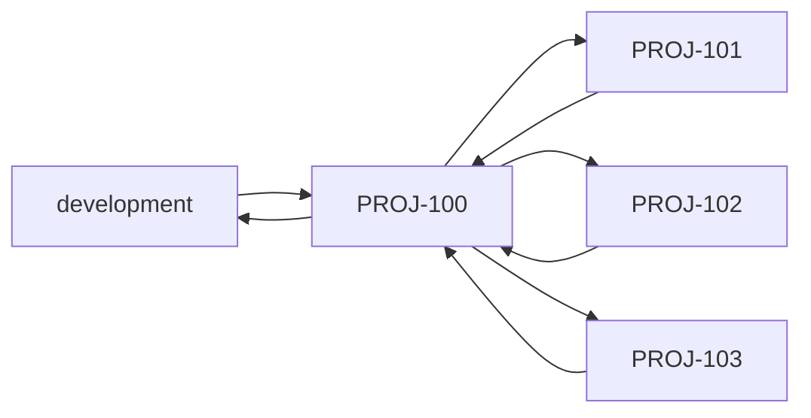
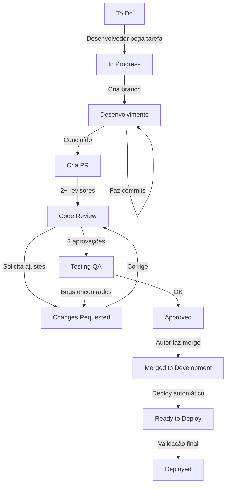

# Git Workflow - Procedimento Operacional Padrão

## 1. Introdução

### 1.1 Objetivo do Documento

Este documento estabelece o **procedimento operacional padrão** para o fluxo de trabalho com Git na Berry, garantindo que todas as atividades de desenvolvimento sejam realizadas de forma **consistente**, **rastreável** e **padronizada**. O objetivo é criar um processo de desenvolvimento organizado, mensurável e que possibilite tomadas de decisões antecipadas.

### 1.2 Escopo de Aplicação

Este documento aplica-se a:

- **Desenvolvedores** (Frontend e Backend)
- **Tech Lead**
- **Time de QA**
- **Product Owner** (quando relevante para entendimento do processo)

### 1.3 Benefícios do Processo Padronizado

- **Rastreabilidade**: Todo código pode ser rastreado até sua tarefa de origem
- **Qualidade**: Revisões obrigatórias garantem código de alta qualidade
- **Transparência**: Histórico limpo e organizado facilita auditorias
- **Colaboração**: Processo claro reduz conflitos e retrabalho
- **Eficiência**: Menos tempo gasto resolvendo problemas de integração

---

## 2. Sistema de Identificação de Tarefas

### 2.1 Formato do ID

Toda tarefa no sistema deve possuir um **ID único e padronizado** que será utilizado em todo o ciclo de vida da tarefa, desde sua criação até o deploy em produção.

**Formato Obrigatório**: `[PREFIXO]-[NÚMERO]`

- **PREFIXO**: 3 a 4 letras maiúsculas que identificam o contexto da tarefa
- **NÚMERO**: Sequencial numérico

### 2.2 Prefixos Utilizados na Berry

| Prefixo | Contexto | Exemplo |
|---------|----------|---------|
| `BRY` | Tarefas gerais da Berry | `BRY-123` |
| `MAIA` | Funcionalidades do assistente AI | `MAIA-45` |
| `DEAL` | Sistema de deals/vendas | `DEAL-78` |
| `PROJ` | Sistema de projetos | `PROJ-90` |
| `FIX` | Correções de bugs urgentes | `FIX-89` |

### 2.3 Uso Obrigatório do ID

O ID da tarefa **DEVE aparecer em**:

1. Nome da branch Git: `MAIA-45`
2. Mensagens de commit: `MAIA-45: feat: adiciona análise de leads com IA`
3. Título do Pull Request: `[MAIA-45]: feat: adiciona análise de leads com IA`
4. Comentários de código (quando relevante): `// TODO: MAIA-45 - Implementar retry logic`

---

## 3. Estratégia de Branches

### 3.1 Branches Principais

A Berry utiliza duas branches principais protegidas:

| Branch | Propósito | Proteção |
|--------|-----------|----------|
| `main` | Código em produção | Protegida, sem push direto |
| `development` | Integração de features | Protegida, apenas via PR |

### 3.2 Nomenclatura de Branches de Trabalho

**Formato Obrigatório**: `[ID-da-tarefa]`

#### ✅ Exemplos Corretos

```bash
# Feature de análise de leads
MAIA-45

# Correção de bug no sistema de deals
DEAL-78

# Nova funcionalidade de autenticação
AUTH-56
```

#### ❌ Exemplos Incorretos

```bash
# ❌ ERRADO: Não usa ID da tarefa
feature/lead-analysis

# ❌ ERRADO: Formato diferente do padrão
maia_45_lead_analysis

# ❌ ERRADO: Inclui tipo de tarefa
feature/MAIA-45

# ❌ ERRADO: Minúsculas
maia-45
```

### 3.3 Criação de Branch de Trabalho

**Sempre criar a partir de `development`**:

```bash
# 1. Certifique-se de estar na branch development atualizada
git checkout development
git pull origin development

# 2. Crie a nova branch com o ID da tarefa
git checkout -b MAIA-45

# 3. Confirme que está na branch correta
git branch
# Output: * MAIA-45
```

### 3.4 Hierarquia de Branches para Tarefas Complexas

Quando uma tarefa é dividida em **subtarefas**, a seguinte hierarquia deve ser utilizada:

#### Cenário: Tarefa Principal com Subtarefas

**Tarefa Principal**: `PROJ-100` - Implementar sistema de relatórios
**Subtarefas**:
- `PROJ-101` - Criar modelos de dados para relatórios
- `PROJ-102` - Implementar endpoints de API
- `PROJ-103` - Criar interface de visualização

#### Fluxo de Branches



#### Comandos Git para Hierarquia

```bash
# 1. Criar branch da tarefa principal a partir de development
git checkout development
git pull origin development
git checkout -b PROJ-100

# 2. Criar branch da primeira subtarefa a partir da tarefa principal
git checkout PROJ-100
git checkout -b PROJ-101

# 3. Após concluir PROJ-101, fazer merge de volta em PROJ-100
git checkout PROJ-100
git merge PROJ-101

# 4. Repetir para outras subtarefas
git checkout PROJ-100
git checkout -b PROJ-102
# ... desenvolver ...
git checkout PROJ-100
git merge PROJ-102

# 5. Apenas após TODAS as subtarefas, fazer PR de PROJ-100 para development
git push origin PROJ-100
# Criar PR: PROJ-100 -> development
```

### 3.5 Quando Criar Branches Hierárquicas

✅ **Use hierarquia quando**:
- A tarefa tem **alto nível de dependências** entre subtarefas
- As subtarefas precisam ser desenvolvidas **sequencialmente**
- O código de uma subtarefa depende diretamente de outra

❌ **Não use hierarquia quando**:
- As subtarefas são **independentes** entre si
- Podem ser desenvolvidas em **paralelo**
- Neste caso, cada subtarefa cria branch diretamente de `development`

---

## 4. Padrão de Commits

### 4.1 Formato Obrigatório

**Estrutura**: `[ID-da-tarefa]: <tipo>: <descrição>`

```
[MAIA-45]: feat: adiciona análise de leads com IA
│          │     │
│          │     └─ Descrição clara do que foi feito
│          └─────── Tipo do commit
└────────────────── ID da tarefa
```

### 4.2 Tipos de Commit

| Tipo | Descrição | Exemplo |
|------|-----------|---------|
| `feat` | Nova funcionalidade | `[MAIA-45]: feat: adiciona análise de leads` |
| `fix` | Correção de bug | `[DEAL-78]: fix: corrige cálculo de CAC` |
| `docs` | Alterações em documentação | `[BRY-12]: docs: atualiza README com setup` |
| `style` | Formatação (sem mudança de lógica) | `[USER-34]: style: formata código com prettier` |
| `refactor` | Refatoração de código | `[PROJ-90]: refactor: simplifica lógica de cálculo` |
| `test` | Adiciona ou corrige testes | `[CHAT-12]: test: adiciona testes unitários` |
| `chore` | Tarefas de build, config, etc | `[BRY-56]: chore: atualiza dependências` |

### 4.3 Regras para Mensagens de Commit

#### ✅ Boas Práticas

- **Atomicidade**: Cada commit representa UMA única mudança lógica
- **Clareza**: Descrição deve ser autoexplicativa
- **Imperativo**: Use verbo no imperativo ("adiciona", não "adicionado")
- **Português**: Sempre em português do Brasil
- **Tamanho**: Descrição curta (máx 72 caracteres)

#### ✅ Exemplos Corretos

```bash
git commit -m "[MAIA-45]: feat: adiciona validação de email com regex"
git commit -m "[DEAL-78]: fix: corrige erro ao calcular CAC com desconto"
git commit -m "[USER-34]: refactor: extrai lógica de autenticação para service"
git commit -m "[PROJ-90]: test: adiciona testes para cálculo de métricas"
git commit -m "[BRY-12]: docs: documenta processo de deploy em produção"
```

#### ❌ Exemplos Incorretos

```bash
# ❌ ERRADO: Sem ID da tarefa
git commit -m "adiciona validação de email"

# ❌ ERRADO: Sem tipo
git commit -m "[MAIA-45]: adiciona validação"

# ❌ ERRADO: Descrição vaga
git commit -m "[MAIA-45]: feat: ajustes"

# ❌ ERRADO: Múltiplas mudanças não relacionadas
git commit -m "[MAIA-45]: feat: adiciona validação e corrige bug e atualiza docs"

# ❌ ERRADO: Verbo no passado
git commit -m "[MAIA-45]: feat: adicionado validação de email"
```

### 4.4 Commits Atômicos: Por Que São Importantes

**Commit Atômico** = Uma mudança lógica e completa por commit

**Benefícios**:
- Facilita code review (menos código para revisar por vez)
- Histórico limpo e compreensível
- Rollback preciso (reverter apenas o que quebrou)
- Bisect eficiente (encontrar bug com `git bisect`)

#### Exemplo de Sequência Atômica

```bash
# ❌ ERRADO: Tudo em um commit
git commit -m "[MAIA-45]: feat: implementa análise de leads completa"

# ✅ CORRETO: Commits atômicos
git commit -m "[MAIA-45]: feat: cria interface LeadAnalysis"
git commit -m "[MAIA-45]: feat: implementa serviço de análise de leads"
git commit -m "[MAIA-45]: test: adiciona testes para LeadAnalysisService"
git commit -m "[MAIA-45]: feat: integra análise de leads no controller"
```

---

## 5. Pull Requests (PRs)

### 5.1 Quando Criar um Pull Request

Um PR deve ser criado quando:

- O desenvolvimento da tarefa foi **concluído**
- O código está **testado localmente**
- **Todos os testes unitários** estão passando
- O código está **formatado** (prettier, linter)
- Não há **conflitos** com a branch de destino

### 5.2 Título do Pull Request

**Formato Obrigatório**: `[ID-da-tarefa]: <tipo>: <descrição>`

```
[MAIA-45]: feat: implementa análise de leads com IA
```

### 5.3 Branch de Destino

**Sempre aponta para `development`**

❌ **NUNCA** crie PR direto para `main`

```bash
# Criar PR no GitHub
# De: MAIA-45
# Para: development
```

### 5.4 Estrutura Obrigatória da Descrição

Todo PR **DEVE** conter a seguinte estrutura:

```markdown
## O que foi feito (What, Why, What Problem)

[Explicação clara do que foi implementado, por que foi feito e qual problema foi resolvido]

## Passos para Testar

1. [Passo a passo para reproduzir/testar a funcionalidade]
2. [Seja específico sobre URLs, dados necessários, etc]
3. [Inclua cenários de sucesso e erro]

## Critérios de Validação

- [ ] Critério 1: [O que deve ser verificado]
- [ ] Critério 2: [Comportamento esperado]
- [ ] Critério 3: [Casos de borda testados]

## Screenshots/GIFs

[OBRIGATÓRIO para qualquer mudança visual]
[Use ferramentas como Loom, Imgur, etc]

## Notas Adicionais

[Qualquer informação relevante, decisões técnicas, débitos técnicos, etc]
```

#### Exemplo Real de Descrição de PR

```markdown
## O que foi feito (What, Why, What Problem)

Implementa análise automática de leads usando IA do GPT-4o-mini para classificar
qualidade do lead (score 1-5) baseado em informações da empresa, desafio reportado
e potencial de receita.

**Por que**: O processo manual de qualificação de leads estava consumindo muito
tempo do time comercial e gerando inconsistência nas avaliações.

**Problema resolvido**: Leads agora são automaticamente qualificados em menos de
5 segundos, com critérios padronizados e rastreáveis.

## Passos para Testar

1. Acesse `/deals/new` no ambiente de desenvolvimento
2. Preencha o formulário de lead com:
   - Nome da empresa: "Tech Solutions LTDA"
   - Desafio: "Preciso automatizar processo de vendas"
   - Faturamento anual: "R$ 500.000"
3. Clique em "Criar Lead"
4. Verifique que o lead foi criado com score automático (1-5)
5. Acesse a aba "Histórico" e confirme que o log de análise está presente

## Critérios de Validação

- [ ] Lead recebe score entre 1 e 5 automaticamente
- [ ] Análise completa em menos de 10 segundos
- [ ] Log de análise é gravado no histórico
- [ ] Erro de API da OpenAI é tratado gracefully
- [ ] Testes unitários do LeadAnalysisService estão passando

## Screenshots/GIFs


## Notas Adicionais

- Consumo estimado: ~0.0001 USD por análise (GPT-4o-mini)
- Cache de 1 hora para análises repetidas
- Fallback para score 3 em caso de erro da API
```

### 5.5 Processo de Aprovação

#### Requisitos para Aprovação

- **2 aprovações** de outros desenvolvedores são **obrigatórias**
- Pelo menos **1 aprovação do Tech Lead** (recomendado)
- Todos os **comentários respondidos** pelo autor
- Todos os **testes automatizados passando**
- **CI/CD pipeline** em verde (quando aplicável)

#### Responsabilidades do Autor do PR

Durante o processo de revisão, o **autor** deve:

- Responder a **todos os comentários** dos revisores
- Explicar **decisões técnicas** quando questionado
- Fazer **ajustes solicitados** em novos commits
- Manter o PR **atualizado** com development (resolver conflitos)
- **Não fazer squash** dos commits até aprovação final

#### Responsabilidades do Revisor

O **revisor** deve focar em:

- **Simplificar** o código quando possível
- Garantir que os **padrões** estão sendo seguidos
- Fazer **perguntas construtivas** (não críticas destrutivas)
- Testar a funcionalidade **localmente** (quando relevante)
- Aprovar **rapidamente** se tudo estiver OK

**Objetivo**: Colaborar, não ser um portão. Code review é uma conversa técnica.

### 5.6 Etapa "Changes Requested"

Se um revisor solicita alterações:

🔴 **PRIORIDADE MÁXIMA**: O desenvolvedor deve **parar** o que está fazendo
🔴 Resolver o feedback **imediatamente**
🔴 Mover o PR de volta para **Code Review** o mais rápido possível

**Por quê?**: Feedback de code review tem validade curta. Se demorar, o revisor
perde contexto e precisa reler tudo novamente, atrasando o processo.

### 5.7 Método de Merge

Após **2 aprovações** e **QA OK**, o **autor do PR** faz o merge.

**Método Obrigatório**: **Squash and Merge**

#### Por Que Squash and Merge?

- Mantém histórico limpo (1 commit por feature)
- Facilita `git bisect` e rollbacks
- Remove commits "WIP", "fix typo", etc
- Mensagem final segue o padrão

#### Passo a Passo do Merge

```bash
# 1. No GitHub, após 2 aprovações, clique em "Squash and Merge"

# 2. A mensagem final DEVE seguir o padrão:
[MAIA-45]: feat: implementa análise de leads com IA

Implementa análise automática de leads usando GPT-4o-mini para
classificar qualidade do lead baseado em informações da empresa.

- Adiciona LeadAnalysisService
- Integra com OpenAI API
- Implementa cache de 1 hora
- Adiciona testes unitários e E2E

# 3. Confirme o merge

# 4. Delete a branch MAIA-45 no GitHub
```

---

## 6. Fluxo Completo de Trabalho

### 6.1 Jornada Completa de uma Tarefa



### 6.2 Passo a Passo Detalhado

#### **Estágio 1: To Do**

**Ação**: Selecionar próxima tarefa (respeitar prioridades do PO)

```bash
# Verificar que entendeu os critérios de aceitação
# Esclarecer dúvidas com PO ou Tech Lead ANTES de iniciar
```

#### **Estágio 2: In Progress**

**Ação**: Criar branch e desenvolver

```bash
# 1. Atualizar development
git checkout development
git pull origin development

# 2. Criar branch
git checkout -b MAIA-45

# 3. Desenvolver seguindo padrões TypeScript
# (Ver CLAUDE.md para padrões de código)

# 4. Fazer commits atômicos
git add src/maia/lead-analysis.service.ts
git commit -m "[MAIA-45]: feat: cria serviço de análise de leads"

git add src/maia/lead-analysis.service.test.ts
git commit -m "[MAIA-45]: test: adiciona testes para LeadAnalysisService"

# 5. Push para origin
git push origin MAIA-45
```

#### **Estágio 3: Code Review**

**Ação**: Criar Pull Request

```bash
# 1. No GitHub, criar PR de MAIA-45 para development

# 2. Preencher descrição completa (ver seção 5.4)

# 3. Solicitar revisão de 2 desenvolvedores
# (GitHub: "Reviewers" sidebar -> selecionar 2 pessoas)

# 4. Aguardar feedback
```

#### **Estágio 4: Changes Requested**

**Ação**: Resolver feedback imediatamente

```bash
# 1. Ler comentários dos revisores

# 2. Fazer ajustes no código
git add .
git commit -m "[MAIA-45]: refactor: simplifica lógica conforme review"

# 3. Push e notificar revisores
git push origin MAIA-45
# Responder comentários no GitHub marcando como "Resolved"
```

#### **Estágio 5: Testing (QA)**

**Ação**: QA valida funcionalidade

```bash
# Desenvolvedor deve:
# - Estar disponível para dúvidas do QA
# - Corrigir bugs encontrados rapidamente
# - Manter PR atualizado com development
```

#### **Estágio 6: Approved**

**Ação**: Fazer merge

```bash
# 1. Verificar que tem 2 aprovações

# 2. No GitHub, clicar "Squash and Merge"

# 3. Editar mensagem final do commit squashado:
[MAIA-45]: feat: implementa análise de leads com IA

# 4. Confirmar merge

# 5. Deletar branch MAIA-45
```

#### **Estágio 7: Ready to Deploy**

**Ação**: Deploy automático para homologação

```bash
# CI/CD pipeline faz deploy automaticamente
# QA valida em ambiente de homologação
```

#### **Estágio 8: Deployed**

**Ação**: Tarefa em produção

```bash
# Deploy para produção (geralmente manual)
# QA faz teste de fumaça em produção
```

---

## 7. Cenários Especiais

### 7.1 Hotfixes em Produção

**Situação**: Bug crítico em produção precisa ser corrigido urgentemente.

#### Processo de Hotfix

```bash
# 1. Criar branch direto de main (exceção à regra)
git checkout main
git pull origin main
git checkout -b FIX-89

# 2. Fazer correção mínima
git add .
git commit -m "[FIX-89]: fix: corrige erro crítico em cálculo de CAC"

# 3. Criar PR para main (exceção à regra)
# GitHub: FIX-89 -> main

# 4. Code review RÁPIDO (1 aprovação suficiente)

# 5. Merge imediato para main

# 6. IMPORTANTE: Fazer merge do hotfix para development também
git checkout development
git pull origin development
git merge main
git push origin development
```

**Atenção**: Hotfixes devem ser **raros**. Se está fazendo hotfix toda semana, há um problema no processo de QA.

### 7.2 Resolvendo Conflitos de Merge

**Situação**: Sua branch está desatualizada e há conflitos com development.

```bash
# 1. Atualizar sua branch local
git checkout MAIA-45
git fetch origin

# 2. Fazer rebase com development
git rebase origin/development

# 3. Resolver conflitos manualmente
# Editar arquivos em conflito, remover marcadores <<<<<<, ======, >>>>>>

# 4. Adicionar arquivos resolvidos
git add .

# 5. Continuar rebase
git rebase --continue

# 6. Force push (necessário após rebase)
git push origin MAIA-45 --force-with-lease

# Alternativa (mais segura para iniciantes): merge ao invés de rebase
git checkout MAIA-45
git merge origin/development
# Resolver conflitos
git add .
git commit -m "[MAIA-45]: chore: resolve conflitos com development"
git push origin MAIA-45
```

**Dica**: Use `--force-with-lease` ao invés de `--force`. É mais seguro pois não
sobrescreve mudanças que outros fizeram.

### 7.3 Rollback de Código

**Situação**: Deploy em produção causou problema grave e precisa reverter.

#### Opção 1: Revert do Merge Commit

```bash
# 1. Identificar o commit do merge que causou problema
git log --oneline main
# Exemplo: abc1234 [MAIA-45]: feat: implementa análise de leads com IA

# 2. Reverter o merge
git checkout main
git revert abc1234

# 3. Criar PR de revert
git push origin main
# Criar PR: main -> production (ou deploy direto se urgente)
```

#### Opção 2: Rollback Completo para Versão Anterior

```bash
# ATENÇÃO: Use apenas em emergências extremas

# 1. Identificar versão estável anterior
git log --oneline main

# 2. Resetar main para essa versão
git checkout main
git reset --hard abc0000  # Commit da versão estável

# 3. Force push (CUIDADO!)
git push origin main --force-with-lease

# 4. Comunicar time IMEDIATAMENTE
```

---

## 8. Boas Práticas e Anti-Patterns

### 8.1 ✅ Boas Práticas

#### Commits

✅ **Commit cedo e frequentemente** (commits pequenos)
✅ **Teste antes de commitar** (rodar testes localmente)
✅ **Use mensagens descritivas** (não "fix", "ajustes", etc)
✅ **Um commit = uma mudança lógica** (atomicidade)

#### Pull Requests

✅ **PRs pequenos** (< 400 linhas alteradas)
✅ **Descrição completa** (ver template seção 5.4)
✅ **Screenshots obrigatórios** para mudanças visuais
✅ **Self-review** antes de solicitar revisão
✅ **Responda todos os comentários** rapidamente

#### Code Review

✅ **Revisar em até 4 horas** após solicitação
✅ **Fazer perguntas, não críticas** ("Por que escolheu X?" não "X está errado")
✅ **Sugerir soluções** quando apontar problemas
✅ **Aprovar rapidamente** se tudo OK (não seja bloqueador)

#### Geral

✅ **Pull antes de push** (sempre atualizar antes)
✅ **Resolver conflitos localmente** (não no GitHub)
✅ **Deletar branches** após merge
✅ **Comunicar problemas** cedo (não esconder)

### 8.2 ❌ Anti-Patterns (O Que Evitar)

#### Commits

❌ **Commits gigantes** (> 1000 linhas)
❌ **Mensagens vagas** ("fix", "atualiza código", "ajustes")
❌ **Commitar código quebrado** (testes falhando)
❌ **Misturar mudanças não relacionadas** (feat + fix + refactor)
❌ **"WIP" commits** em PR (squash antes de solicitar review)

#### Pull Requests

❌ **PRs gigantes** (> 1000 linhas)
❌ **Descrição vazia** ou apenas "implementa feature X"
❌ **Sem testes** para código novo
❌ **Ignorar feedback** dos revisores
❌ **Force push** após alguém ter feito review

#### Branches

❌ **Branches de longa duração** (> 1 semana sem merge)
❌ **Branches sem nome padronizado** (feature/minha-feature)
❌ **Desenvolver direto em main ou development**
❌ **Esquecer de deletar branches** após merge

#### Code Review

❌ **Demorar dias** para revisar
❌ **Aprovar sem ler** o código
❌ **Ser rude** ou destrutivo nos comentários
❌ **Pedir mudanças** sem sugerir alternativas
❌ **Aprovar "LGTM"** sem contexto (explicar O QUE está bom)

### 8.3 Dicas de Produtividade

#### Git Aliases Úteis

Adicione ao seu `~/.gitconfig`:

```bash
[alias]
    # Status curto
    s = status -s

    # Log bonito
    lg = log --graph --pretty=format:'%Cred%h%Creset -%C(yellow)%d%Creset %s %Cgreen(%cr) %C(bold blue)<%an>%Creset' --abbrev-commit

    # Atualizar development
    up = !git checkout development && git pull origin development

    # Criar branch nova
    nb = "!f() { git up && git checkout -b $1; }; f"

    # Commit rápido (use com cuidado!)
    cm = "!f() { git add . && git commit -m \"$1\"; }; f"

    # Push e criar PR (abre navegador)
    pr = "!gh pr create --web"
```

**Uso**:

```bash
# Criar nova branch
git nb MAIA-45

# Log bonito
git lg

# Push e abrir PR
git push origin MAIA-45
git pr
```

#### GitHub CLI (gh)

```bash
# Instalar
brew install gh

# Criar PR via CLI
gh pr create --title "[MAIA-45]: feat: análise de leads" --body "$(cat pr-template.md)"

# Listar PRs
gh pr list

# Ver status dos checks
gh pr checks

# Aprovar PR
gh pr review 123 --approve

# Merge PR
gh pr merge 123 --squash
```

#### VSCode Extensions Recomendadas

- **GitLens**: Histórico inline, blame, etc
- **Git Graph**: Visualizar branches graficamente
- **GitHub Pull Requests**: Gerenciar PRs sem sair do VSCode
- **Conventional Commits**: Autocompletar tipo de commit

---

## 9. Troubleshooting

### 9.1 Problemas Comuns e Soluções

#### "Meu push foi rejeitado"

```bash
# Erro: Updates were rejected because the remote contains work...

# Solução: Atualizar branch local
git pull origin MAIA-45 --rebase
git push origin MAIA-45
```

#### "Esqueci de criar branch, comitei em development"

```bash
# Solução: Mover commits para nova branch
git checkout development
git branch MAIA-45  # Cria branch com commits atuais
git reset --hard origin/development  # Volta development ao estado remoto
git checkout MAIA-45
git push origin MAIA-45
```

#### "Preciso desfazer último commit"

```bash
# Desfazer mas manter mudanças
git reset --soft HEAD~1

# Desfazer e descartar mudanças
git reset --hard HEAD~1
```

#### "Comitei na branch errada"

```bash
# Mover último commit para outra branch
git checkout MAIA-45
git cherry-pick abc1234  # ID do commit
git checkout branch-errada
git reset --hard HEAD~1
```

#### "Conflitos durante rebase"

```bash
# 1. Resolver conflitos nos arquivos
# 2. Adicionar arquivos resolvidos
git add .

# 3. Continuar rebase
git rebase --continue

# Se der muito errado, abortar
git rebase --abort
```

### 9.2 Comandos Git Úteis

```bash
# Ver histórico de um arquivo específico
git log --follow src/maia/lead-analysis.service.ts

# Ver mudanças de um commit específico
git show abc1234

# Buscar por texto em commits antigos
git log --all --grep="análise de leads"

# Ver quem alterou cada linha de um arquivo
git blame src/maia/lead-analysis.service.ts

# Desfazer mudanças em arquivo específico
git checkout -- src/maia/lead-analysis.service.ts

# Limpar arquivos não rastreados
git clean -fd

# Ver diferença entre branches
git diff development..MAIA-45

# Encontrar commit que introduziu bug (bisect)
git bisect start
git bisect bad  # Commit atual está com bug
git bisect good abc0000  # Commit que funcionava
# Git vai testando commits intermediários
```

### 9.3 Checklist Antes de Criar PR

Use este checklist para garantir que seu PR está pronto:

**Código**
- Código segue padrões do CLAUDE.md
- Sem console.log ou debuggers esquecidos
- Sem código comentado desnecessário
- Variáveis e funções com nomes descritivos
- Lógica complexa está comentada

**Testes**
- Testes unitários escritos e passando
- Testes cobrem casos de borda
- `pnpm test` executado localmente sem erros
- Coverage não regrediu

**Formatação**
- `pnpm lint:fix` executado
- Prettier aplicado
- Sem warnings de TypeScript

**Branch**
- Branch criada com nome correto (ID da tarefa)
- Commits seguem padrão [ID]: tipo: descrição
- Branch atualizada com development (sem conflitos)

**PR**
- Título do PR segue padrão
- Descrição completa (WWW, passos, critérios)
- Screenshots/GIFs para mudanças visuais
- Labels apropriadas adicionadas
- Reviewers solicitados (2 pessoas)

---

## 10. Referências

### 10.1 Documentos Relacionados

- [CLAUDE.md](../../CLAUDE.md) - Padrões de código TypeScript e arquitetura
- [code-review.md](./code-review.md) - Guia detalhado de code review
- [task-management.md](./task-management.md) - Gestão de tarefas no Plane.so

### 10.2 Ferramentas

- [GitHub - BerryMax](https://github.com/berry/berrymax)
- [Plane.so - Board](https://plane.so/berry/projects)
- [GitHub CLI](https://cli.github.com/)
- [GitLens VSCode Extension](https://marketplace.visualstudio.com/items?itemName=eamodio.gitlens)

### 10.3 Glossário

| Termo | Definição |
|-------|-----------|
| **Commit Atômico** | Commit que representa uma única mudança lógica |
| **Squash** | Combinar múltiplos commits em um único commit |
| **Rebase** | Reescrever histórico de commits aplicando-os em nova base |
| **Force Push** | Sobrescrever histórico remoto (usar com cuidado) |
| **Cherry-pick** | Aplicar commit específico de uma branch em outra |
| **PR** | Pull Request - Solicitação de merge de código |
| **WIP** | Work In Progress - Trabalho em andamento |
| **LGTM** | Looks Good To Me - Aprovação em code review |

---

## 11. Controle de Versão do Documento

| Versão | Data | Autor | Mudanças |
|--------|------|-------|----------|
| 1.0 | 2025-01-19 | Tech Lead | Versão inicial do documento |

---

**Dúvidas?** Entre em contato com o Tech Lead ou abra uma discussão no canal #dev do Slack.
