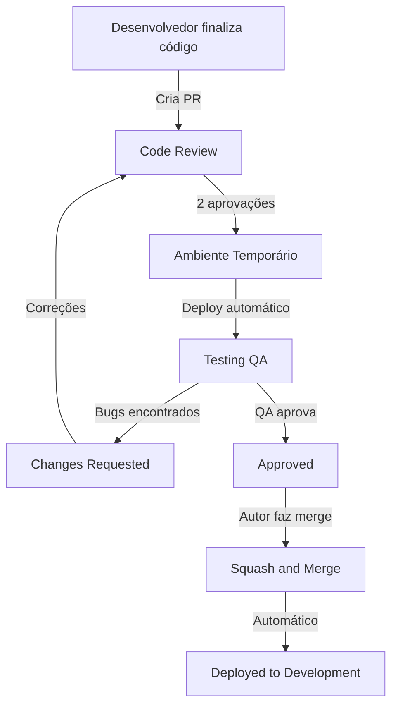

# Pull Requests - Guia Completo da Berry

**Versão:** 1.0.0
**Última atualização:** 28 de Novembro de 2025
**Responsável:** Tech Lead

---

## Índice

- [Introdução](#introdução)
- [Anatomia de um Pull Request](#anatomia-de-um-pull-request)
- [Antes de Criar um PR](#antes-de-criar-um-pr)
- [Criando o Pull Request](#criando-o-pull-request)
- [Durante o Code Review](#durante-o-code-review)
- [Após Aprovações: Validação QA](#após-aprovações-validação-qa)
- [Merge do Pull Request](#merge-do-pull-request)
- [Cenários Especiais](#cenários-especiais)
- [Checklist Completo](#checklist-completo)
- [Boas Práticas e Anti-Patterns](#boas-práticas-e-anti-patterns)
- [Exemplos Práticos](#exemplos-práticos)
- [FAQ](#faq)
- [Ferramentas e Automação](#ferramentas-e-automação)
- [Referências](#referências)

---

## Introdução

### 1.1 Objetivo do Documento

Este documento estabelece o **padrão de Pull Requests (PRs)** na Berry, detalhando como criar, revisar e fazer merge de código de forma consistente e profissional. O Pull Request é o principal mecanismo para integrar código na base, garantindo qualidade através de revisões técnicas e validação de QA.

### 1.2 Importância dos Pull Requests

Pull Requests são fundamentais para:

- **Qualidade de Código**: Revisões obrigatórias antes de qualquer integração
- **Rastreabilidade**: Cada mudança é documentada e vinculada a uma tarefa
- **Colaboração**: Compartilhamento de conhecimento entre o time
- **Transparência**: Histórico completo de decisões técnicas
- **Validação**: QA testa em ambiente isolado antes de produção
- **Documentação**: PRs servem como documentação viva das mudanças

### 1.3 Fluxo Geral de um PR na Berry



**Diferencial Berry**: Após 2 aprovações de desenvolvedores, um **ambiente temporário** é criado automaticamente para QA testar. Apenas após aprovação de QA o merge é realizado.

---

## Anatomia de um Pull Request

### 2.1 Título do Pull Request

**Formato Obrigatório**: `[ID-da-tarefa]: <tipo>: <descrição>`

#### Componentes

- **ID da tarefa**: Identificador único (ex: `MAIA-45`, `BRY-123`, `FIX-89`)
- **Tipo**: Categoria da mudança (feat, fix, docs, etc)
- **Descrição**: Resumo claro e objetivo (máx 72 caracteres)

#### Exemplos Corretos

```
[MAIA-45]: feat: implementa análise de leads com IA
[DEAL-78]: fix: corrige cálculo de CAC em leilões
[PROJ-90]: feat: adiciona filtros avançados na lista de projetos
[BRY-123]: refactor: simplifica lógica de autenticação
[FIX-89]: fix: corrige erro crítico em pagamento Stripe
```

#### Exemplos Incorretos

```
❌ Adiciona análise de leads              # Sem ID da tarefa
❌ [MAIA-45] análise de leads             # Sem tipo
❌ [MAIA-45]: implementa feature          # Descrição vaga
❌ MAIA-45: feat: análise de leads        # Faltam colchetes no ID
```

### 2.2 Descrição Estruturada do PR

Todo PR **DEVE** seguir este template obrigatório:

```markdown
## O que foi feito, por que foi feito e qual problema foi resolvido (WWW)

[Explicação clara do que foi implementado, a motivação por trás da mudança
e qual problema específico foi resolvido]

## Como foi implementado

[Descrição técnica da abordagem utilizada, decisões arquiteturais,
bibliotecas/frameworks utilizados]

## Passos para testar

1. [Passo a passo específico para reproduzir/validar a funcionalidade]
2. [Incluir URLs, dados de teste, credenciais se necessário]
3. [Cobrir cenários de sucesso e erro]

## Critérios de validação

- [ ] Critério 1: [O que deve ser verificado]
- [ ] Critério 2: [Comportamento esperado]
- [ ] Critério 3: [Edge cases testados]

## Screenshots/GIFs

[OBRIGATÓRIO para mudanças visuais. Use ferramentas como Loom, Imgur, etc]

## Notas técnicas

[Decisões técnicas importantes, débitos técnicos conhecidos,
impacto em outras partes do sistema, etc]
```

### 2.3 Exemplo Completo de Descrição

```markdown
## O que foi feito, por que foi feito e qual problema foi resolvido (WWW)

Implementa análise automática de leads usando IA do GPT-4o-mini para classificar
qualidade do lead (score 1-5) baseado em informações da empresa, desafio reportado
e potencial de receita.

**Por que**: O processo manual de qualificação de leads estava consumindo muito
tempo do time comercial e gerando inconsistência nas avaliações.

**Problema resolvido**: Leads agora são automaticamente qualificados em menos de
5 segundos, com critérios padronizados e rastreáveis.

## Como foi implementado

- **Backend**: Criado `LeadAnalysisService` com integração OpenAI API
- **Cache**: Redis com TTL de 15 minutos para reduzir custos
- **Validação**: Schema Zod para input validation
- **Listeners**: Integrado com `CrmLeadAnalysisUseCase` (Priority 10)
- **Frontend**: Nova aba "Análise IA" no detalhe do lead

## Passos para testar

1. Acesse `/deals/new` no ambiente de desenvolvimento
2. Preencha o formulário de lead:
   - Nome da empresa: "Tech Solutions LTDA"
   - Desafio: "Preciso automatizar processo de vendas"
   - Faturamento anual: "R$ 500.000"
3. Clique em "Criar Lead"
4. Verifique que o lead foi criado com score automático (1-5)
5. Acesse a aba "Análise IA" e confirme que análise detalhada está presente
6. Criar outro lead com mesmos dados para testar cache (deve ser instantâneo)

## Critérios de validação

- [ ] Lead recebe score entre 1 e 5 automaticamente
- [ ] Análise completa em menos de 10 segundos
- [ ] Log de análise gravado no histórico do lead
- [ ] Erro de API da OpenAI é tratado gracefully (fallback para score 3)
- [ ] Cache funciona: 2ª análise idêntica retorna em < 100ms
- [ ] Testes unitários do `LeadAnalysisService` passando (90%+ coverage)
- [ ] Interface responsiva (mobile + desktop)

## Screenshots/GIFs


## Notas técnicas

**Decisões**:
- Escolhido GPT-4o-mini ao invés de GPT-4 por custo 10x menor e latência 2x melhor
- Cache de 15min (ao invés de 1h) para balance entre custo e freshness de dados

**Consumo estimado**: ~$0.0001 USD por análise
**Fallback**: Se API falhar, sistema retorna score 3 (neutro) e log de erro

---

## Antes de Criar um PR

### 3.1 Checklist Pré-PR Obrigatório

Antes de criar um Pull Request, você **DEVE** verificar todos os itens abaixo. Este checklist garante que seu PR está pronto para revisão e não desperdiça o tempo dos revisores.

#### Código e Qualidade

- [ ] **Código compila sem erros**: Execute `pnpm build` e verifique que não há erros de TypeScript
- [ ] **Linter passando**: Execute `pnpm lint:fix` e corrija todos os warnings
- [ ] **Testes unitários passando**: Execute `pnpm test` e verifique que todos os testes estão passando
- [ ] **Coverage não regrediu**: Verifique que a cobertura de testes está acima de 90% (ou pelo menos não diminuiu)
- [ ] **Self-review realizado**: Revise seu próprio código linha por linha como se fosse outra pessoa
- [ ] **Código segue padrões**: Verifique aderência ao [CLAUDE.md](../../CLAUDE.md) (tipos explícitos, imports corretos, etc)
- [ ] **Sem código comentado**: Remova código comentado desnecessário ou explique por que está comentado
- [ ] **Sem console.log/debugger**: Remova todos os `console.log` e `debugger` esquecidos

#### Testes e Validação

- [ ] **Testes escritos**: Código novo tem testes unitários correspondentes
- [ ] **Testado localmente**: Funcionalidade foi testada manualmente no ambiente local
- [ ] **Edge cases cobertos**: Testes cobrem casos de sucesso, erro e borda
- [ ] **Dados de teste preparados**: Se necessário, prepare dados de exemplo para QA testar

#### Branch e Commits

- [ ] **Branch atualizada**: Execute `git pull origin development` e resolva conflitos se houver
- [ ] **Commits atômicos**: Cada commit representa uma mudança lógica única
- [ ] **Mensagens de commit corretas**: Seguem padrão `[ID]: tipo: descrição`
- [ ] **Sem commits WIP**: Remova commits "WIP", "teste", "fix" antes de criar PR

#### Documentação do PR

- [ ] **Descrição completa**: Preencheu todos os campos do template (WWW, Como, Passos, Critérios)
- [ ] **Screenshots/GIFs**: Para mudanças visuais, anexou imagens ou vídeos
- [ ] **Título correto**: Segue formato `[ID]: tipo: descrição`
- [ ] **Branch de destino**: PR aponta para `development` (nunca `main`)

#### CI/CD

- [ ] **Pipeline verde**: CI/CD está passando (quando aplicável)
- [ ] **Sem conflitos**: Branch não tem conflitos com `development`

### 3.2 Self-Review: Por Que É Importante

**Self-review** é o processo de revisar seu próprio código antes de solicitar revisão de outros. É uma etapa crítica que:

- **Reduz tempo de revisão**: Você encontra e corrige problemas óbvios antes
- **Melhora qualidade**: Código chega mais limpo aos revisores
- **Demonstra profissionalismo**: Mostra que você se importa com qualidade
- **Acelera aprovação**: Revisores aprovam mais rápido quando código está bem feito

#### Como Fazer Self-Review Efetivo

**1. Leia o código linha por linha**

```bash
# Use git diff para ver todas as mudanças
git diff development..MAIA-45

# Ou use ferramenta visual
git difftool development..MAIA-45
```

**2. Faça perguntas a si mesmo**

- Este código é legível para outra pessoa?
- Nomes de variáveis/funções são descritivos?
- Lógica complexa está comentada?
- Há código duplicado que pode ser extraído?
- Edge cases estão tratados?
- Erros são tratados adequadamente?

**3. Verifique padrões do projeto**

- Segue [CLAUDE.md](../../CLAUDE.md)?
- Usa TypeScript com tipos explícitos?
- Imports usam `@app/*` aliases?
- Backend: Eventos emitidos corretamente?
- Frontend: Usa `observer` e `useObservable`?

**4. Teste mentalmente**

- O código faz o que a tarefa pede?
- Todos os critérios de aceitação foram atendidos?
- O que acontece em caso de erro?
- Performance está adequada?

### 3.3 Preparação de Dados de Teste

Se sua funcionalidade requer dados específicos para testar, prepare-os antes de criar o PR:

**Exemplo de Dados de Teste no PR**:

```markdown
## Dados de Teste

**Credenciais**:
- Usuário de teste: `qa-test@berry.com.br`
- Senha: `Test123!`

**Dados criados no ambiente de desenvolvimento**:
- Deal: DEAL-999 (status MQL, valor R$ 100.000)
- Organização: "Empresa Teste LTDA"
- Contato: João Silva (joao@teste.com.br)

**Como criar**:
1. Acesse `/deals/new`
2. Use os dados acima
3. Ou importe via GraphQL usando mutation `createDeal`
```

### 3.4 Screenshots e GIFs

Para **qualquer mudança visual**, screenshots são **obrigatórios**.

**Ferramentas Recomendadas**:

- **Loom**: Para gravar fluxos completos (gratuito, até 5min)
- **Imgur**: Para upload rápido de imagens
- **GitHub**: Upload direto arrastando imagem no PR

**O Que Capturar**:

- **Antes e Depois**: Se mudou UI existente
- **Fluxo Completo**: GIF mostrando funcionalidade end-to-end
- **Estados Diferentes**: Loading, erro, sucesso, vazio
- **Responsivo**: Mobile e desktop se aplicável
- **Dark Mode**: Se aplicável

**Exemplo de Seção de Screenshots**:

```markdown
## Screenshots/GIFs

### Desktop


### Mobile


### Fluxo Completo

```

---

## Criando o Pull Request

### 4.1 Passo a Passo no GitHub

#### 1. Push da Branch

```bash
# Certifique-se de que todos os commits estão na branch
git push origin MAIA-45
```

#### 2. Criar PR no GitHub

1. Acesse o repositório no GitHub
2. Clique em **"Pull requests"** → **"New pull request"**
3. Selecione:
   - **Base**: `development` (sempre!)
   - **Compare**: `MAIA-45` (sua branch)
4. Clique em **"Create pull request"**

#### 3. Preencher Informações

**Título** (obrigatório):
```
[MAIA-45]: feat: implementa análise de leads com IA
```

**Descrição** (obrigatório):
- Cole o template completo da seção 2.2
- Preencha todos os campos
- Adicione screenshots/GIFs se aplicável

#### 4. Selecionar Reviewers

- Clique em **"Reviewers"** no sidebar direito
- Selecione **2 desenvolvedores** (obrigatório)
- Recomendado: Incluir Tech Lead se PR for complexo

#### 5. Labels (Opcional mas Recomendado)

Adicione labels relevantes:
- `backend` ou `frontend`
- `feature`, `bugfix`, `refactor`, `docs`
- `priority:high` se urgente

#### 6. Draft vs Ready for Review

**Draft PR**: Use quando PR ainda não está pronto
- Permite compartilhar progresso
- Não notifica revisores
- Marque como "Ready for Review" quando completo

**Ready for Review**: PR está completo e pronto para revisão
- Notifica revisores automaticamente
- Aparece na lista de PRs pendentes

### 4.2 Criando PR via GitHub CLI

Alternativa mais rápida para desenvolvedores que preferem terminal:

```bash
# Instalar GitHub CLI (se não tiver)
brew install gh

# Autenticar
gh auth login

# Criar PR
gh pr create \
  --title "[MAIA-45]: feat: implementa análise de leads com IA" \
  --body-file pr-description.md \
  --base development \
  --reviewer @username1,@username2 \
  --label backend,feature
```

**Vantagens**:
- Mais rápido que interface web
- Pode usar arquivo markdown para descrição
- Integra com scripts de automação

### 4.3 Branch de Destino: Sempre `development`

⚠️ **REGRA CRÍTICA**: Todo PR **DEVE** apontar para `development`.

❌ **NUNCA** crie PR direto para `main`

**Por quê?**:
- `main` é código em produção
- `development` é ambiente de integração
- QA testa em `development` antes de produção
- Permite rollback fácil se necessário

**Exceção**: Apenas hotfixes (`FIX-XXX`) podem ir direto para `main` (ver seção 8.1).

### 4.4 Labels e Organização

Labels ajudam a organizar e priorizar PRs:

**Labels por Tipo**:
- `feature`: Nova funcionalidade
- `bugfix`: Correção de bug
- `refactor`: Refatoração de código
- `docs`: Documentação
- `chore`: Tarefas de build/config

**Labels por Área**:
- `backend`: Mudanças no backend
- `frontend`: Mudanças no frontend
- `api`: Mudanças na API GraphQL
- `infra`: Infraestrutura/deploy

**Labels por Prioridade**:
- `priority:high`: Urgente, revisar primeiro
- `priority:low`: Pode aguardar

**Labels por Status**:
- `blocked`: Aguardando dependência
- `needs-qa`: Pronto para QA testar
- `wip`: Work in progress (draft)

---

## Durante o Code Review

### 5.1 O Que Esperar dos Revisores

#### Tempo de Resposta

**Meta da Berry**: Revisores devem responder em até **4 horas** durante horário comercial.

**O que fazer se demorar mais**:
- Aguarde até 24 horas antes de lembrar
- Se passar 24 horas, envie mensagem respeitosa no Slack:
  ```markdown
  @reviewer Olá! Vi que você foi solicitado para revisar o PR #123. 
  Se puder dar uma olhada quando tiver um tempinho, agradeço! 🙏
  ```

#### Tipos de Feedback

Revisores podem dar 4 tipos de feedback:

**1. [Bloqueador]**: Deve ser corrigido antes de avançar
```markdown
**[Bloqueador]** Esta query está causando N+1. Precisa usar DataLoader.
```

**2. [Sugestão]**: Bom ter, mas não obrigatório
```markdown
**[Sugestão]** Que tal renomear `data` para `userProfile` para mais clareza?
```

**3. [Nitpick]**: Preferência pessoal, autor decide
```markdown
**[Nitpick]** Eu prefiro usar `??` ao invés de `||` aqui, mas ambos funcionam.
```

**4. [Pergunta]**: Busca entendimento, não é crítica
```markdown
**[Pergunta]** Por que optou por usar `useState` ao invés de `useObservable` aqui?
```

### 5.2 Como Responder Comentários

#### Regra de Ouro: Responda Todos os Comentários

Mesmo que seja apenas:
- "Corrigido no commit abc123"
- "Boa observação, ajustei"
- "Discordamos por motivo X, vamos escalar?"

#### Quando Concordar com Sugestão

```markdown
Faz muito sentido! Vou refatorar para usar DataLoader.

**Commit**: abc1234
```

**Ações**:
1. Faça a mudança
2. Commit com mensagem descritiva
3. Push para branch
4. Marque comentário como "Resolved" no GitHub
5. Responda no thread

#### Quando Discordar Respeitosamente

```markdown
Entendo sua preocupação, mas acredito que a abordagem atual é mais simples porque:

1. Não precisamos de cache global aqui
2. Performance não é crítica (roda 1x por dia)
3. Facilita testes unitários

O que você acha? Se ainda achar importante, podemos escalar para @tech-lead.
```

**Dica**: Sempre explique o "por quê" da sua decisão. Revisores podem não ter todo o contexto.

#### Quando Não Entender

```markdown
Não entendi bem sua sugestão. Pode explicar melhor ou dar um exemplo de código?

Ou podemos fazer uma call rápida de 15min para alinhar?
```

**Não tenha vergonha de perguntar**: É melhor esclarecer do que implementar algo errado.

### 5.3 Aceitar vs Discordar de Sugestões

#### Quando Aceitar

✅ **Aceite quando**:
- Sugestão melhora legibilidade
- Sugestão corrige bug real
- Sugestão segue padrões do projeto
- Sugestão não adiciona complexidade desnecessária

#### Quando Discordar

✅ **Discorde quando**:
- Sua abordagem é mais simples
- Sugestão adiciona complexidade sem benefício claro
- Sugestão conflita com requisitos de negócio
- Você tem contexto que revisor não tem

**Importante**: Discordar é OK, mas sempre explique o motivo e seja respeitoso.

### 5.4 Escalando para Tech Lead

Escale para Tech Lead quando:

**1. Impasse entre autor e revisor**

```markdown
@tech-lead Temos visões diferentes sobre usar abordagem A vs B aqui.

**Contexto**: [explicação breve]

**Abordagem A** (atual): [pros e cons]
**Abordagem B** (sugestão): [pros e cons]

Pode nos ajudar a decidir?
```

**2. Decisão arquitetural complexa**

```markdown
@tech-lead Este PR introduz nova dependência (Redis) para cache.
Antes de seguir, queria validar se faz sentido arquiteturalmente.

**Contexto**: [explicação]
**Alternativas consideradas**: [lista]
```

**3. PR muito grande e precisa dividir**

```markdown
@tech-lead Este PR ficou grande (800 linhas). Sugestão de como dividir?

**Opção 1**: Dividir em 3 PRs menores
**Opção 2**: Manter assim mas revisar em partes

Qual prefere?
```

### 5.5 Referência Cruzada com Code Review

Para detalhes completos sobre o processo de code review, consulte:
- [code-review.md](./code-review.md) - Guia completo de code review
- Seção 4: Responsabilidades do Autor do PR
- Seção 5: Responsabilidades do Revisor
- Seção 6: Integração com QA

---

## Após Aprovações: Validação QA

### 6.1 Processo Automático de Ambiente Temporário

Após **2 aprovações de desenvolvedores**, o seguinte acontece automaticamente:

1. **CI/CD detecta 2 aprovações**
2. **Ambiente temporário é criado**: Branch do PR é deployada isoladamente
3. **URL única é gerada**: Ex: `pr-123.staging.berry.com`
4. **QA recebe notificação**: Link do ambiente é enviado para QA
5. **QA inicia testes**: Valida funcionalidade no ambiente isolado

**Vantagens do Ambiente Temporário**:
- QA testa código real, não apenas na máquina do desenvolvedor
- Testes não afetam ambiente de desenvolvimento compartilhado
- Fácil compartilhar com stakeholders para validação
- Rollback fácil se problemas forem encontrados

### 6.2 Responsabilidades do Autor Durante Testes QA

#### Estar Disponível

🔴 **PRIORIDADE**: Não inicie nova tarefa complexa até QA validar seu PR.

**Por quê?**:
- QA pode ter dúvidas que precisam resposta rápida
- Bugs encontrados precisam correção imediata
- Manter contexto da tarefa facilita correções

**O que fazer**:
- Fique disponível no Slack durante horário comercial
- Responda dúvidas do QA em até 2 horas
- Explique fluxos que não estão óbvios

#### Fornecer Dados de Teste

Se QA precisar de dados específicos, forneça:

```markdown
**Dados de teste criados no ambiente temporário**:

- Usuário: qa-test@berry.com.br / senha: Test123!
- Deal: DEAL-999 (status MQL, valor R$ 100.000)
- Organização: "Empresa Teste LTDA"
- Contato: João Silva (joao@teste.com.br)

**Como acessar**:
1. Login com credenciais acima
2. Navegue para `/deals/DEAL-999`
3. Teste funcionalidade X
```

#### Monitorar Logs

- Acompanhe logs do ambiente temporário
- Se QA reportar erro, já tenha contexto do que aconteceu
- Facilita diagnóstico rápido de problemas

### 6.3 O Que Fazer Quando QA Encontra Bugs

#### Passo 1: Agradecer e Confirmar

```markdown
Obrigado por reportar, @qa-member! Vou investigar.
```

**Importante**: Sempre agradeça. QA está ajudando a melhorar qualidade.

#### Passo 2: Reproduzir Localmente

```bash
# Clone os passos do QA
# Confirme que consegue reproduzir o bug
# Se não conseguir, peça mais detalhes
```

#### Passo 3: Corrigir e Commitar

```bash
# Fazer correção
git add .
git commit -m "[MAIA-45]: fix: corrige filtro com caracteres especiais"
git push origin MAIA-45
```

**Ambiente temporário é atualizado automaticamente** após push.

#### Passo 4: Notificar QA

```markdown
Bug corrigido!

**Problema**: Filtro não tratava acentuação.
**Solução**: Adicionei normalização de strings.
**Commit**: abc1234

Ambiente temporário já foi atualizado automaticamente. 
Pode re-testar quando possível! 🙏
```

### 6.4 Correções Pequenas vs Grandes

#### Correções Pequenas (Não Precisa Re-Review)

**O que são**:
- Typos e erros de digitação
- Ajustes de CSS/styling
- Validações simples
- Mensagens de erro
- Ajustes de texto/UI

**Processo**:
1. Autor corrige
2. QA re-testa
3. **Não precisa** de nova aprovação de revisores
4. QA aprova → merge automático

#### Correções Grandes (Precisa Re-Review)

**O que são**:
- Mudança de lógica significativa
- Refatoração de código
- Mudança de arquitetura
- Nova funcionalidade adicionada

**Processo**:
1. Autor corrige
2. Autor notifica revisores:
   ```markdown
   @reviewer1 @reviewer2
   
   Precisei mudar significativamente a lógica após feedback do QA.
   
   **Mudança**: Ao invés de calcular score no frontend, movemos para backend.
   
   **Arquivos afetados**:
   - `src/maia/lead-score.service.ts` (novo)
   - `src/modules/deal/deal-analysis.tsx` (refatorado)
   
   Podem revisar novamente? Obrigado!
   ```
3. Revisores aprovam novamente
4. QA testa
5. QA aprova → merge automático

**Dica**: Quando em dúvida se precisa re-review, pergunte aos revisores.

---

## Merge do Pull Request

### 7.1 Quando Fazer Merge

Você pode fazer merge quando **TODOS** estes critérios forem atendidos:

✅ **2 aprovações** de desenvolvedores  
✅ **QA aprovou** funcionalidade  
✅ **Todos os comentários** foram respondidos  
✅ **CI/CD pipeline** está verde  
✅ **Sem conflitos** com `development`

⚠️ **NÃO faça merge se**:
- Apenas 1 aprovação (precisa de 2)
- QA ainda não testou
- Há comentários não respondidos
- Pipeline está falhando

### 7.2 Método Obrigatório: Squash and Merge

**Método Único Permitido**: **Squash and Merge**

❌ **NÃO use**:
- Merge commit
- Rebase and merge

**Por quê Squash and Merge?**:
- Mantém histórico limpo (1 commit por feature)
- Facilita `git bisect` e rollbacks
- Remove commits "WIP", "fix typo", etc
- Mensagem final segue padrão do projeto

### 7.3 Como Escrever Mensagem Final do Merge

Ao fazer squash and merge, GitHub permite editar a mensagem final. **SEMPRE edite** para seguir o padrão:

**Formato Obrigatório**:

```
[MAIA-45]: feat: implementa análise de leads com IA

Implementa análise automática de leads usando GPT-4o-mini para
classificar qualidade do lead baseado em informações da empresa.

- Adiciona LeadAnalysisService
- Integra com OpenAI API
- Implementa cache de 15 minutos
- Adiciona testes unitários (90%+ coverage)
- Nova aba "Análise IA" no frontend
```

**Componentes**:
1. **Primeira linha**: Título do PR (já preenchido automaticamente)
2. **Segunda linha em branco**
3. **Corpo**: Descrição resumida do que foi feito
4. **Lista**: Bullet points com principais mudanças

### 7.4 Passo a Passo do Merge

#### 1. Verificar Critérios

Antes de clicar em "Merge", confirme:
- ✅ 2 aprovações visíveis no PR
- ✅ QA comentou "Aprovado" ou similar
- ✅ Pipeline verde
- ✅ Sem conflitos

#### 2. Clicar em "Squash and Merge"

No GitHub, no PR:
1. Clique no dropdown "Merge pull request"
2. Selecione **"Squash and Merge"**
3. Clique em **"Squash and merge"**

#### 3. Editar Mensagem Final

GitHub mostrará tela de edição. **SEMPRE edite**:

**Antes (padrão do GitHub)**:
```
Implementa análise de leads com IA (#123)

* Implementa análise de leads
* Adiciona testes
```

**Depois (padrão Berry)**:
```
[MAIA-45]: feat: implementa análise de leads com IA

Implementa análise automática de leads usando GPT-4o-mini.

- Adiciona LeadAnalysisService com integração OpenAI
- Implementa cache Redis (15min TTL)
- Adiciona testes unitários (90%+ coverage)
- Nova aba "Análise IA" no frontend
```

#### 4. Confirmar Merge

Clique em **"Confirm squash and merge"**.

#### 5. Deletar Branch

Após merge, GitHub oferece opção de deletar branch. **SEMPRE delete**:
- Clique em **"Delete branch"**
- Ou delete manualmente: `git push origin --delete MAIA-45`

### 7.5 O Que Acontece Automaticamente Após Merge

Após merge para `development`:

1. **CI/CD detecta merge**
2. **Deploy automático** para ambiente de desenvolvimento
3. **Notificação enviada** para time
4. **Ambiente temporário destruído** (se ainda existir)
5. **Branch deletada** (se você marcou a opção)

**Próximos Passos**:
- QA pode fazer teste de fumaça em `development`
- Se tudo OK, código pode ir para produção em próximo deploy
- Tarefa pode ser marcada como "Completed" no Plane.so

---

## Cenários Especiais

### 8.1 Hotfixes Urgentes (FIX-XXX)

Para branches `FIX-XXX` (bugs críticos em produção):

#### Processo Simplificado

**Diferenças do processo normal**:

| Aspecto | Processo Normal | Hotfix (FIX-XXX) |
|---------|-----------------|------------------|
| Aprovações | 2 desenvolvedores | 1 aprovação (Tech Lead obrigatório) |
| Tempo de review | Até 4 horas | Até 1 hora |
| Branch origem | `development` | `main` |
| Branch destino | `development` | `main` |
| Ambiente temporário | Obrigatório | Opcional (pode pular em casos extremos) |
| QA | Validação completa | Validação express |

#### Passo a Passo de Hotfix

```bash
# 1. Criar branch direto de main (exceção à regra)
git checkout main
git pull origin main
git checkout -b FIX-89

# 2. Fazer correção mínima
git add .
git commit -m "[FIX-89]: fix: corrige erro crítico em cálculo de CAC"

# 3. Criar PR para main (exceção à regra)
# GitHub: FIX-89 -> main

# 4. Solicitar review do Tech Lead (obrigatório)
# Tech Lead revisa em até 1 hora

# 5. Após aprovação, fazer merge imediato

# 6. IMPORTANTE: Fazer merge do hotfix para development também
git checkout development
git pull origin development
git merge main
git push origin development
```

#### Após Hotfix

Criar issue para melhorias futuras:

```markdown
[BRY-XXX] Refatorar lógica do hotfix FIX-89

**Contexto**: Hotfix FIX-89 resolveu bug crítico mas código pode ser melhorado.

**Tarefas**:
- [ ] Adicionar testes unitários
- [ ] Refatorar função X para melhor legibilidade
- [ ] Adicionar documentação
- [ ] Revisar se solução pode ser mais robusta
```

### 8.2 PRs Grandes (> 400 Linhas)

PRs com mais de 400 linhas alteradas são difíceis de revisar e aumentar risco de bugs.

#### Quando Dividir um PR

✅ **Divida quando**:
- PR tem > 400 linhas alteradas (excluindo testes e configs gerados)
- PR mistura múltiplas features não relacionadas
- PR tem mudanças em áreas diferentes do sistema
- Revisores pedem para dividir

#### Como Dividir

**Estratégia 1: Por Camada**

```bash
# PR 1: Backend (service, controller)
MAIA-45-backend

# PR 2: Frontend (components, hooks)
MAIA-45-frontend

# PR 3: Testes (se muitos)
MAIA-45-tests
```

**Estratégia 2: Por Funcionalidade**

```bash
# PR 1: Feature core
MAIA-45-core

# PR 2: Feature extra
MAIA-45-extra

# PR 3: Integração
MAIA-45-integration
```

**Estratégia 3: Sequencial (quando há dependências)**

```bash
# PR 1: Base (deve ser mergeado primeiro)
MAIA-45-base

# PR 2: Depende de PR 1
MAIA-45-feature
```

#### Exemplo de Divisão

**PR Original**: 800 linhas, implementa sistema de relatórios completo

**Dividido em**:

1. **PR 1**: `[PROJ-100]: feat: cria modelos de dados para relatórios` (150 linhas)
2. **PR 2**: `[PROJ-101]: feat: implementa endpoints de API` (200 linhas)
3. **PR 3**: `[PROJ-102]: feat: cria interface de visualização` (250 linhas)
4. **PR 4**: `[PROJ-103]: test: adiciona testes E2E` (200 linhas)

### 8.3 PRs Dependentes

Quando PR B depende de PR A:

#### Estratégia: Branch da Branch

```bash
# 1. PR A: Feature base
git checkout development
git checkout -b PROJ-100
# ... desenvolver ...
git push origin PROJ-100
# Criar PR: PROJ-100 -> development

# 2. PR B: Feature que depende de A
git checkout PROJ-100  # Branch da branch A
git checkout -b PROJ-101
# ... desenvolver usando código de PROJ-100 ...
git push origin PROJ-101
# Criar PR: PROJ-101 -> PROJ-100 (não development!)
```

**No GitHub**:
- PR B aponta para PR A (não `development`)
- Quando PR A for mergeado, PR B automaticamente aponta para `development`
- PR B pode ser mergeado após PR A

#### Marcar como Dependente

No PR B, mencione dependência:

```markdown
**Depende de**: #123 (PR A)

Este PR adiciona funcionalidade X que depende da base criada em #123.
Aguardando merge de #123 antes de revisar este.
```

### 8.4 Resolvendo Conflitos de Merge

Se sua branch está desatualizada e há conflitos:

#### Opção 1: Rebase (Recomendado)

```bash
# 1. Atualizar branch local
git checkout MAIA-45
git fetch origin

# 2. Fazer rebase com development
git rebase origin/development

# 3. Resolver conflitos manualmente
# Editar arquivos em conflito, remover marcadores <<<<<<, ======, >>>>>>

# 4. Adicionar arquivos resolvidos
git add .

# 5. Continuar rebase
git rebase --continue

# 6. Force push (necessário após rebase)
git push origin MAIA-45 --force-with-lease
```

**⚠️ Cuidado**: `--force-with-lease` é mais seguro que `--force`. Não sobrescreve mudanças que outros fizeram.

#### Opção 2: Merge (Mais Seguro para Iniciantes)

```bash
# 1. Atualizar branch local
git checkout MAIA-45
git fetch origin

# 2. Fazer merge com development
git merge origin/development

# 3. Resolver conflitos manualmente
# Editar arquivos em conflito

# 4. Adicionar arquivos resolvidos
git add .

# 5. Commit do merge
git commit -m "[MAIA-45]: chore: resolve conflitos com development"

# 6. Push normal
git push origin MAIA-45
```

**Dica**: Se conflitos são muitos ou complexos, peça ajuda ao Tech Lead.

### 8.5 Rollback de Merge

Se merge causou problema grave em `development`:

#### Opção 1: Revert do Merge Commit

```bash
# 1. Identificar commit do merge
git log --oneline development
# Exemplo: abc1234 [MAIA-45]: feat: implementa análise de leads

# 2. Reverter o merge
git checkout development
git revert abc1234 -m 1

# 3. Push
git push origin development
```

#### Opção 2: Rollback Completo (Emergência)

⚠️ **Use apenas em emergências extremas**

```bash
# 1. Identificar versão estável anterior
git log --oneline development

# 2. Resetar para versão anterior
git checkout development
git reset --hard abc0000  # Commit da versão estável

# 3. Force push (CUIDADO!)
git push origin development --force-with-lease

# 4. Comunicar time IMEDIATAMENTE
```

**Após rollback**:
- Criar issue para investigar problema
- Corrigir código
- Criar novo PR com correções

---

## Checklist Completo

### 9.1 Checklist Pré-PR

Use este checklist antes de criar PR:

#### Código
- [ ] Código compila sem erros (`pnpm build`)
- [ ] Linter passando (`pnpm lint:fix`)
- [ ] Sem `console.log` ou `debugger` esquecidos
- [ ] Sem código comentado desnecessário
- [ ] Código segue padrões do [CLAUDE.md](../../CLAUDE.md)
- [ ] Nomes de variáveis/funções são descritivos
- [ ] Lógica complexa está comentada

#### Testes
- [ ] Testes unitários escritos e passando (`pnpm test`)
- [ ] Coverage não regrediu (mínimo 90%)
- [ ] Testes cobrem casos de sucesso, erro e borda
- [ ] Funcionalidade testada manualmente localmente

#### Branch e Commits
- [ ] Branch atualizada com `development` (sem conflitos)
- [ ] Commits atômicos (uma mudança lógica por commit)
- [ ] Mensagens de commit seguem padrão `[ID]: tipo: descrição`
- [ ] Sem commits "WIP", "teste", "fix" no PR final

#### PR
- [ ] Título segue formato `[ID]: tipo: descrição`
- [ ] Descrição completa (WWW, Como, Passos, Critérios)
- [ ] Screenshots/GIFs para mudanças visuais
- [ ] Branch de destino é `development`
- [ ] 2 reviewers selecionados
- [ ] Labels apropriadas adicionadas

#### CI/CD
- [ ] Pipeline está verde (quando aplicável)
- [ ] Self-review realizado

### 9.2 Checklist Durante Code Review

#### Responder Feedback
- [ ] Todos os comentários foram respondidos
- [ ] Mudanças solicitadas foram implementadas
- [ ] Comentários marcados como "Resolved" quando aplicável
- [ ] Explicações dadas para decisões questionadas

#### Manter PR Atualizado
- [ ] Branch atualizada com `development` (sem conflitos)
- [ ] Novos commits seguem padrão de mensagem
- [ ] Pipeline continua verde após mudanças

#### Comunicação
- [ ] Respostas são respeitosas e construtivas
- [ ] Discordâncias são explicadas com motivos
- [ ] Tech Lead escalado quando necessário

### 9.3 Checklist Antes de Merge

#### Aprovações
- [ ] 2 aprovações de desenvolvedores obtidas
- [ ] QA aprovou funcionalidade
- [ ] Todos os comentários respondidos

#### Status
- [ ] Pipeline CI/CD está verde
- [ ] Sem conflitos com `development`
- [ ] Ambiente temporário foi testado pelo QA

#### Merge
- [ ] Método: Squash and Merge (não outro)
- [ ] Mensagem final editada para seguir padrão
- [ ] Branch será deletada após merge

---

## Boas Práticas e Anti-Patterns

### 10.1 Boas Práticas

#### Para Autores

✅ **Self-review antes de solicitar**: Revise seu próprio PR linha por linha antes de marcar como "Ready for Review"

✅ **Mantenha PRs pequenos**: < 400 linhas alteradas (exclui testes e configs gerados)

✅ **Explique decisões não óbvias**: Comentários no código ou na descrição do PR

✅ **Responda todos os comentários**: Mesmo que seja "Corrigido" ou "Discordamos por X motivo"

✅ **Agradeça feedback**: "Boa observação!" ou "Não tinha pensado nisso, obrigado!"

✅ **Separe feedback dos commits originais**: Não faça squash até ter todas as aprovações

✅ **Teste localmente**: Rode build, lint, testes antes de pedir review

✅ **Fique disponível durante QA**: Responda dúvidas rapidamente

✅ **Screenshots obrigatórios**: Para qualquer mudança visual

✅ **Descrição completa**: Preencha todos os campos do template

#### Para Revisores

✅ **Revise em até 4 horas**: Evite bloquear o fluxo do autor

✅ **Leia a descrição do PR primeiro**: Entenda o contexto antes de ver o código

✅ **Faça perguntas**: "Por que escolheu esta abordagem?" ao invés de "Mude para X"

✅ **Teste o código**: Faça checkout da branch e rode localmente para mudanças complexas

✅ **Aprove explicitamente**: Clique em "Approve" no GitHub e comente "LGTM" ou "Ready to merge"

✅ **Ofereça aprender**: "Não conhecia esta técnica. Pode me explicar melhor?"

✅ **Balanceie rigor e pragmatismo**: Perfeição é inimiga do progresso

✅ **Confie no QA**: Sua aprovação + QA = código pronto para produção

#### Para QA

✅ **Teste em até 24 horas**: Após ambiente temporário estar disponível

✅ **Siga critérios de aceitação**: Use tarefa como checklist

✅ **Reporte bugs claramente**: Passos para reproduzir, screenshots, severidade

✅ **Teste edge cases**: Não apenas fluxo feliz

✅ **Comunique início dos testes**: "Iniciando testes do PR #123"

### 10.2 Anti-Patterns

#### Para Autores

❌ **PRs gigantes**: > 1000 linhas misturando múltiplas features

❌ **Descrição vazia**: Apenas "implementa feature X" sem detalhes

❌ **Ignorar feedback**: Marcar como "Resolved" sem implementar mudança

❌ **Defender ego**: Levar críticas como pessoais ao invés de técnicas

❌ **Commits WIP**: Deixar commits "WIP", "teste", "fix" no PR final

❌ **Solicitar review antes de CI passar**: Desperdiçar tempo do revisor

❌ **Sumir durante QA**: Não responder dúvidas do QA

❌ **Merge antes de QA aprovar**: Não respeitar processo

❌ **Force push após review**: Reescrever histórico após alguém revisar

#### Para Revisores

❌ **Demorar dias**: Deixar PR sem feedback por 24+ horas sem justificativa

❌ **Aprovar sem ler**: "LGTM" sem realmente ter revisado o código

❌ **Ser rude**: "Que código horrível" ou "Você não sabe TypeScript?"

❌ **Reescrever o PR**: Fazer 50 comentários para mudar tudo ao seu estilo

❌ **Nitpicks bloqueadores**: Exigir mudança de `,` para `;` como bloqueador

❌ **Debates teóricos**: Discutir filosofia de programação por 2 horas nos comentários

❌ **Falta de contexto**: Comentar sem entender o requisito de negócio

#### Para QA

❌ **Testar superficialmente**: Apenas fluxo feliz, ignorar edge cases

❌ **Reportar bugs vagos**: "Não funciona" sem passos para reproduzir

❌ **Demorar semanas**: Deixar PR parado aguardando testes

❌ **Aprovar sem testar**: Confiar que "deve estar funcionando"

---

## Exemplos Práticos

### 11.1 Exemplo Completo: PR de Feature Backend

**PR**: `[MAIA-45]: feat: implementa análise de leads com IA`

#### Descrição do PR

```markdown
## O que foi feito, por que foi feito e qual problema foi resolvido (WWW)

Implementa análise automática de leads usando IA do GPT-4o-mini para classificar
qualidade do lead (score 1-5) baseado em informações da empresa, desafio reportado
e potencial de receita.

**Por que**: O processo manual de qualificação de leads estava consumindo muito
tempo do time comercial e gerando inconsistência nas avaliações.

**Problema resolvido**: Leads agora são automaticamente qualificados em menos de
5 segundos, com critérios padronizados e rastreáveis.

## Como foi implementado

- **Backend**: Criado `LeadAnalysisService` com integração OpenAI API
- **Cache**: Redis com TTL de 15 minutos para reduzir custos
- **Validação**: Schema Zod para input validation
- **Listeners**: Integrado com `CrmLeadAnalysisUseCase` (Priority 10)
- **Frontend**: Nova aba "Análise IA" no detalhe do lead

## Passos para testar

1. Acesse `/deals/new` no ambiente de desenvolvimento
2. Preencha o formulário de lead:
   - Nome da empresa: "Tech Solutions LTDA"
   - Desafio: "Preciso automatizar processo de vendas"
   - Faturamento anual: "R$ 500.000"
3. Clique em "Criar Lead"
4. Verifique que o lead foi criado com score automático (1-5)
5. Acesse a aba "Análise IA" e confirme que análise detalhada está presente

## Critérios de validação

- [ ] Lead recebe score entre 1 e 5 automaticamente
- [ ] Análise completa em menos de 10 segundos
- [ ] Log de análise gravado no histórico do lead
- [ ] Erro de API da OpenAI é tratado gracefully (fallback para score 3)
- [ ] Cache funciona: 2ª análise idêntica retorna em < 100ms
- [ ] Testes unitários do `LeadAnalysisService` passando (90%+ coverage)

## Screenshots/GIFs


## Notas técnicas

- Escolhido GPT-4o-mini ao invés de GPT-4 por custo 10x menor
- Cache de 15min para balance entre custo e freshness
- Consumo estimado: ~$0.0001 USD por análise
```

#### Thread de Review

**Revisor 1**:
```markdown
## Revisão Geral

Ótimo trabalho! A feature está funcional e testes cobrem os casos principais. Alguns pontos:

---

### Comentários

#### `src/maia/lead-analysis.service.ts:23`

**[Sugestão]** Cache de 1 hora pode ser muito para leads que mudam frequentemente.

**Atual**:
```typescript
@cache({ ttl: 60 * 60 * 1000 })
```

**Sugerido**:
```typescript
@cache({ ttl: 15 * 60 * 1000 }) // 15 minutos
```

---

#### `src/maia/lead-analysis.service.ts:45`

**[Bloqueador]** Erro não está sendo tratado. Se API do OpenAI falhar, aplicação vai crashar.

**Problema**:
```typescript
const response = await openai.chat.completions.create(params);
return response.choices[0].message.content;
```

**Correção**:
```typescript
try {
  const response = await openai.chat.completions.create(params);
  return response.choices[0].message.content;
} catch (error) {
  logger.error('OpenAI API error', { error, dealKey });
  throw AppGraphqlError(500, 'Falha ao analisar lead. Tente novamente.');
}
```

---

### Decisão

**Status**: Request Changes

**Ações necessárias**:
1. Adicionar try-catch na linha 45

**Ações opcionais**:
2. Ajustar TTL do cache
```

**Autor**:
```markdown
Obrigado pela revisão detalhada! 🙏

---

#### Sobre cache (linha 23)

**Decisão**: Ajustei para 15 minutos. Faz sentido já que leads podem ser atualizados pelo BDR.

**Commit**: abc1234

---

#### Sobre erro handling (linha 45)

**Decisão**: Adicionei try-catch com log estruturado e erro amigável para usuário.

**Commit**: def5678

---

Correções aplicadas! Pronto para nova revisão. ✅
```

**Revisor 1** (após correções):
```markdown
Perfeito! Correções aplicadas. 👏

**Status**: Approved ✅

Aguardando segunda aprovação e depois QA pode testar!
```

**Revisor 2**:
```markdown
**Status**: Approved ✅

Código está limpo, testes bem escritos. LGTM!
```

#### QA Report

```markdown
**QA Report** - @qa-member

Testando no ambiente: https://pr-45.staging.berry.com

---

### Testes Realizados

✅ Lead criado via formulário recebe score automaticamente
✅ Análise detalhada aparece na aba "Análise IA"
✅ Cache funciona (2ª análise é instantânea)
❌ **Bug encontrado**: Erro ao analisar lead sem telefone

---

### Detalhes do Bug

**Passos para reproduzir**:
1. Criar lead sem preencher campo "Telefone"
2. Sistema tenta analisar
3. Erro 500 na tela

**Esperado**: Sistema deve funcionar mesmo sem telefone (campo opcional)

**Screenshot**: [anexo]

---

@autor Pode corrigir? Depois retesto!
```

**Autor Corrige**:
```markdown
Obrigado por encontrar isso, @qa-member!

**Problema**: Validação esperava telefone obrigatório.
**Solução**: Ajustei schema Zod para tornar telefone opcional.

**Commit**: ghi9012

Ambiente já está atualizado. Pode re-testar quando possível! 🙏
```

**QA Re-testa e Aprova**:
```markdown
**QA Re-test** - @qa-member

✅ Bug corrigido! Lead sem telefone funciona normalmente.
✅ Todos os critérios de aceitação atendidos.

**Status**: Aprovado para merge! 🎉
```

**Merge Realizado**:
```markdown
🤖 Merge automático realizado

Branch MAIA-45 merged into development via Squash and Merge
Environment pr-45.staging.berry.com destroyed
```

### 11.2 Exemplo: PR de Feature Frontend

**PR**: `[PROJ-90]: feat: adiciona filtros avançados na lista de projetos`

#### Thread de Review

**Revisor**:
```markdown
## Revisão Geral

Interface ficou ótima! Filtros funcionam bem. Alguns ajustes:

---

### Comentários

#### `src/modules/project/project-filters.tsx:15`

**[Bloqueador]** Componente não está usando `observer`, então mudanças no `filter$` não vão re-renderizar.

**Correção**:
```typescript
export const ProjectFilters = observer(() => {
  const filter$ = useObservable({ status: [], search: '' });
  // ...
});
```

---

#### Screenshot da interface

Interface está linda! Dark mode funciona perfeitamente. ✨

**[Nitpick]**: Adicionar tooltip explicando o que cada filtro faz.

---

### Decisão

**Status**: Request Changes

**Ações necessárias**:
1. Adicionar `observer` wrapper

**Ações opcionais**:
- Adicionar tooltips
```

**Autor**:
```markdown
Valeu pelo review!

#### Observer (linha 15)

**Corrigido**: Adicionei `observer` wrapper.
**Commit**: jkl3456

#### Tooltips

**Decisão**: Vou deixar para PR futuro. Este já está grande.
**Issue criada**: BRY-456 "Adicionar tooltips em filtros"

---

Pronto para nova revisão! ✅
```

### 11.3 Exemplo: PR de Hotfix

**PR**: `[FIX-89]: fix: corrige erro crítico em pagamento Stripe`

#### Processo Simplificado

**Descrição**:
```markdown
## O que foi feito, por que foi feito e qual problema foi resolvido (WWW)

Corrige bug crítico onde pagamentos Stripe acima de R$ 10.000 falhavam silenciosamente,
causando perda de receita.

**Por que**: Bug em produção afetando clientes pagando valores altos.

**Problema resolvido**: Pagamentos agora funcionam corretamente para qualquer valor.

## Como foi implementado

- Ajustada validação de valor máximo no `StripeService`
- Adicionado log de erro quando pagamento falha
- Teste unitário para valor acima de R$ 10.000

## Passos para testar

1. Criar deal com valor R$ 15.000
2. Tentar processar pagamento via Stripe
3. Verificar que pagamento é processado com sucesso

## Critérios de validação

- [ ] Pagamento acima de R$ 10.000 funciona
- [ ] Log de erro aparece se pagamento falhar
- [ ] Teste unitário passando
```

**Review**:
- **1 aprovação do Tech Lead** (obrigatório para hotfix)
- **Review em 30 minutos** (processo acelerado)
- **Merge imediato** após aprovação

**Após Merge**:
- Merge também feito para `development`
- Issue criada para melhorias futuras: `[BRY-XXX] Refatorar lógica do hotfix FIX-89`

---

## FAQ

### 12.1 Quanto tempo devo esperar por review?

**Meta da Berry**: Revisores devem responder em até **4 horas** durante horário comercial.

**O que fazer**:
- Aguarde até 24 horas antes de lembrar
- Se passar 24 horas, envie mensagem respeitosa no Slack
- Se passar 48 horas, escale para Tech Lead

### 12.2 Posso fazer merge antes de QA aprovar?

❌ **NÃO**. QA aprovação é **obrigatória** antes de merge.

**Por quê?**:
- QA testa em ambiente isolado (não apenas local)
- QA valida critérios de aceitação da tarefa
- QA testa edge cases que desenvolvedores podem esquecer

**Exceção**: Apenas hotfixes podem ter processo acelerado (mas ainda recomendado QA express).

### 12.3 E se revisores discordarem entre si?

**Cenário**: Revisor 1 pede mudança X, Revisor 2 pede mudança Y (oposta).

**Solução**:
1. Discuta com ambos revisores no thread do PR
2. Se impasse persistir, escale para Tech Lead
3. Tech Lead decide baseado em padrões do projeto e contexto

### 12.4 Quando preciso de nova aprovação após correções?

**Não precisa re-review** se correção for:
- Typo ou erro de digitação
- Ajuste de CSS/styling
- Validação simples
- Mensagem de erro
- Ajuste de texto/UI

**Precisa re-review** se correção for:
- Mudança de lógica significativa
- Refatoração de código
- Mudança de arquitetura
- Nova funcionalidade adicionada

**Dica**: Quando em dúvida, pergunte aos revisores ou Tech Lead.

### 12.5 Como saber se ambiente temporário está pronto?

**Sinais de que está pronto**:
- CI/CD pipeline de deploy está verde
- Notificação no Slack com link do ambiente
- QA comenta no PR: "Ambiente pronto, iniciando testes"

**O que fazer**:
- Aguarde notificação
- Se passar 2 horas após 2 aprovações, pergunte no Slack

### 12.6 E se QA não responder?

**Após 24 horas** sem resposta do QA:

1. Envie mensagem respeitosa no Slack:
   ```markdown
   @qa-member Olá! Vi que ambiente temporário do PR #123 está pronto há 24h.
   Se puder dar uma olhada quando tiver um tempinho, agradeço! 🙏
   ```

2. Se passar **48 horas**, escale para Tech Lead:
   ```markdown
   @tech-lead PR #123 está aguardando QA há 48h. Pode ajudar a destravar?
   ```

### 12.7 Posso fazer force push após review?

❌ **NÃO**. Force push após review é **anti-pattern**.

**Por quê?**:
- Reescreve histórico que revisores já viram
- Comentários podem ficar desatualizados
- Pode causar confusão

**Exceção**: Apenas se Tech Lead autorizar explicitamente.

**Alternativa**: Use merge commit para atualizar branch:
```bash
git merge origin/development
git push origin MAIA-45
```

### 12.8 E se meu PR ficou muito grande?

**Se PR tem > 400 linhas**:

1. **Avalie se pode dividir**:
   - PR mistura múltiplas features?
   - Mudanças em áreas diferentes?
   - Pode ser dividido por camada (backend/frontend)?

2. **Se pode dividir**: Divida em PRs menores (ver seção 8.2)

3. **Se não pode dividir**: 
   - Explique no PR por que precisa ser grande
   - Peça revisores para revisar em partes
   - Considere criar PR base primeiro

### 12.9 Posso fazer merge de PR dependente antes do PR base?

❌ **NÃO**. PR dependente só pode ser mergeado após PR base.

**Fluxo correto**:
1. PR base (A) é mergeado
2. PR dependente (B) automaticamente aponta para `development`
3. PR B pode ser mergeado

**Dica**: No PR dependente, mencione claramente a dependência.

---

## Ferramentas e Automação

### 13.1 GitHub Features

#### Draft PRs

Use para PRs em progresso que ainda não estão prontos para review:

```bash
# Criar PR como draft
gh pr create --draft --title "[WIP] MAIA-45: análise de leads"

# Marcar como ready
gh pr ready 123
```

**Vantagens**:
- Permite compartilhar progresso sem notificar revisores
- Não aparece na lista de PRs pendentes de review
- Pode receber feedback antecipado se necessário

#### Request Changes

Use quando houver problemas bloqueadores:

```markdown
**Status**: Request Changes

**Motivo**: Faltam testes unitários para a lógica crítica de cálculo de CAC.
```

**Efeito**: PR não pode ser mergeado até autor corrigir e revisor aprovar novamente.

#### Approve

Use quando PR está pronto para QA:

```markdown
**Status**: Approved ✅

Código está limpo e testes cobrem os casos principais. Ready para QA!
```

**Efeito**: Conta para as 2 aprovações necessárias.

#### Comments

Use para discussões não bloqueadoras:

```markdown
**[Sugestão]** Este nome poderia ser mais descritivo, mas não bloqueia.
```

**Efeito**: Não bloqueia merge, mas autor pode considerar.

### 13.2 GitHub CLI para PRs

#### Instalação

```bash
# macOS
brew install gh

# Autenticar
gh auth login
```

#### Comandos Úteis

```bash
# Criar PR
gh pr create --title "[MAIA-45]: feat: análise de leads" --body-file pr.md

# Listar PRs pendentes de review
gh pr list --search "review-requested:@me"

# Ver diff de um PR
gh pr diff 123

# Fazer checkout local de um PR
gh pr checkout 123

# Aprovar PR
gh pr review 123 --approve --body "LGTM! Testes passaram e código está limpo."

# Solicitar mudanças
gh pr review 123 --request-changes --body "Faltam testes para o caso X."

# Comentar sem aprovar/rejeitar
gh pr review 123 --comment --body "Considere usar DataLoader aqui."

# Ver status dos checks
gh pr checks 123

# Merge PR
gh pr merge 123 --squash
```

### 13.3 Ambientes Temporários

#### Como São Criados

- **Trigger**: Após 2 aprovações de desenvolvedores
- **Processo**: GitHub Actions executa workflow de deploy
- **Resultado**: Branch é deployada em infraestrutura isolada
- **URL**: Gerada automaticamente (ex: `pr-123.staging.berry.com`)
- **Notificação**: Enviada para QA com link

#### Como Acessar

**Via GitHub**:
- Link aparece no PR após criação do ambiente
- Comentário automático do bot com URL

**Via Slack**:
- Notificação automática quando ambiente está pronto
- Link direto para ambiente

#### Como São Destruídos

- **Automaticamente**: Após merge do PR
- **Automaticamente**: Após fechar PR sem merge
- **Manualmente**: Via GitHub Actions (se necessário)

#### Acessar Logs

```bash
# Ver logs do ambiente temporário do PR 123
gh run list --workflow=deploy-pr --limit=1
gh run view 12345 --log
```

### 13.4 Automações Futuras

#### Danger.js (Planejado)

Validações automáticas de PR:

```javascript
// Avisar se PR é muito grande
if (danger.github.pr.additions > 500) {
  warn('Este PR tem mais de 500 linhas. Considere dividir em PRs menores.');
}

// Checar se tem testes
const hasTests = danger.git.modified_files.some(f => f.includes('.test.'));
if (!hasTests) {
  warn('Este PR não adiciona testes. Tem certeza que não precisa?');
}

// Checar se descrição está completa
if (danger.github.pr.body.length < 50) {
  fail('Descrição do PR está muito curta. Preencha o template completo.');
}
```

#### Validações Automáticas (Planejado)

- Verificar se título segue padrão
- Verificar se descrição tem todos os campos obrigatórios
- Verificar se tem screenshots para mudanças visuais
- Verificar se coverage não regrediu

---

## Referências

### 14.1 Documentos Relacionados

- [code-review.md](./code-review.md) - Guia completo de code review
- [git-workflow.md](./git-workflow.md) - Processo de Git e Pull Requests
- [task-management.md](./task-management.md) - Gestão de tarefas no Plane.so
- [CLAUDE.md](../../CLAUDE.md) - Padrões de código e arquitetura

### 14.2 Recursos Externos

- [Google Engineering Practices - Code Review](https://google.github.io/eng-practices/review/)
- [Conventional Comments](https://conventionalcomments.org/)
- [GitHub Code Review Best Practices](https://github.blog/developer-skills/github/how-to-review-code-effectively-a-github-staff-engineers-philosophy/)
- [Atlassian Git Workflows](https://www.atlassian.com/git/tutorials/comparing-workflows)

### 14.3 Glossário

| Termo | Definição |
|-------|-----------|
| **LGTM** | "Looks Good To Me" - Código aprovado |
| **Nitpick** | Comentário menor, preferência pessoal |
| **Bloqueador** | Problema que deve ser corrigido antes de avançar |
| **Self-review** | Autor revisar próprio código antes de solicitar review |
| **WIP** | "Work In Progress" - Trabalho ainda não finalizado |
| **Edge case** | Caso extremo ou raro que pode não funcionar |
| **N+1** | Problema de performance causado por múltiplas queries em loop |
| **Ambiente Temporário** | Deploy isolado da branch do PR para testes |
| **Squash and Merge** | Método de merge que combina todos os commits em um único |
| **Draft PR** | PR marcado como rascunho, não notifica revisores |
| **Changes Requested** | Status quando revisor solicita alterações |
| **Force Push** | Sobrescrever histórico remoto (usar com cuidado) |

### 14.4 Controle de Versão do Documento

| Versão | Data | Autor | Mudanças |
|--------|------|-------|----------|
| 1.0 | 2025-01-28 | Tech Lead | Versão inicial do documento |

---

**Dúvidas?** Entre em contato com o Tech Lead ou abra uma discussão no canal #dev do Slack.
