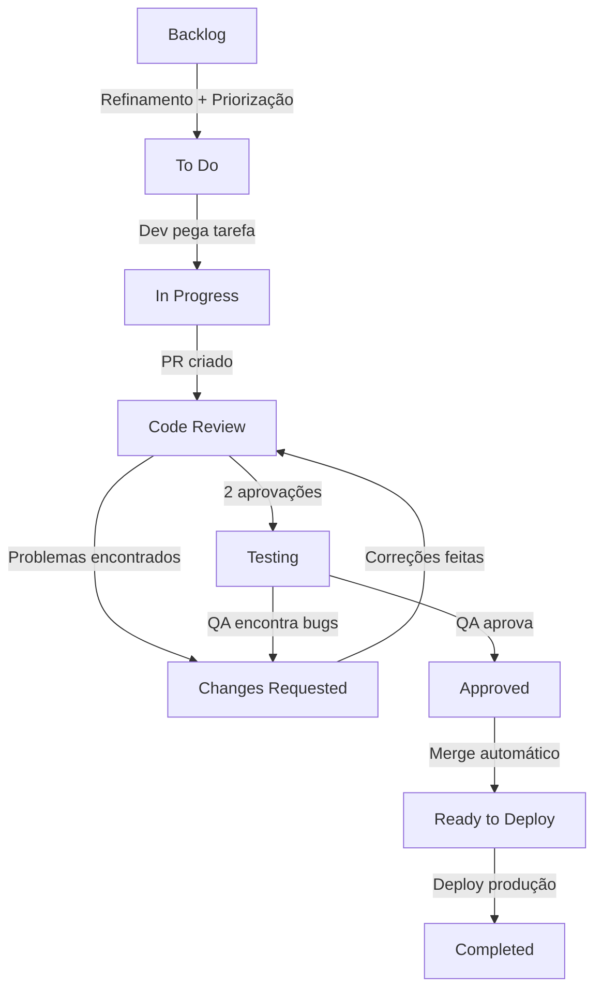

# Task Management - Guia Completo da Berry

## 1. Introdução

### 1.1 Objetivo do Documento

Este documento estabelece o **processo de gerenciamento de tarefas** na Berry, detalhando como tarefas são criadas, estimadas, priorizadas e executadas do início ao fim. O objetivo é garantir fluxo de trabalho padronizado, transparência, qualidade e previsibilidade nas entregas.

### 1.2 Escopo de Aplicação

Este processo se aplica a:

- **Desenvolvedores** (Frontend e Backend): Implementam funcionalidades e corrigem bugs
- **QA**: Validam qualidade das entregas
- **Tech Lead**: Garantem padrões técnicos e arquiteturais
- **Product Owner (PO)**: Definem requisitos e priorizam backlog
- **Project Manager (PM)**: Coordenam fluxo de trabalho e comunicação

### 1.3 Benefícios do Gerenciamento Padronizado

- **Previsibilidade**: Estimativas consistentes permitem planejamento confiável
- **Transparência**: Todos sabem status e prioridades das tarefas
- **Qualidade**: Processo garante revisões e validações em cada etapa
- **Aprendizado**: Retrospectivas identificam melhorias contínuas
- **Redução de Bloqueios**: Prioridades claras evitam gargalos

---

## 2. Sistema de Story Points

### 2.1 O Que São Story Points

**Story Points** são unidades de medida que representam **esforço, complexidade e incerteza** de uma tarefa, não tempo absoluto. Permitem comparar tarefas entre si e prever capacidade do time.

**Importante**: Story points medem **dificuldade relativa**, não horas. Uma tarefa de 3 pontos pode levar 2 horas para um senior e 6 horas para um junior, mas ambos concordam que vale 3 pontos.

### 2.2 Escala Fibonacci Adaptada

Usamos escala Fibonacci modificada: **1, 2, 3, 5, 8, 13**

**Por que Fibonacci?** Números maiores têm gaps maiores, refletindo que quanto maior a tarefa, maior a incerteza.

### 2.3 Tabela de Referência de Pontuação

| Pontos | Esforço | Complexidade | Incerteza | Duração Estimada | Risco |
|--------|---------|--------------|-----------|------------------|-------|
| **1** | Mínimo | Trivial | Nenhuma | Minutos a 1 hora | Muito baixo |
| **2** | Baixo | Simples | Baixa | 1-2 horas | Baixo |
| **3** | Médio | Moderada | Média | Meio dia (2-4 horas) | Médio |
| **5** | Alto | Complexa | Alta | 1 dia (6-8 horas) | Alto |

**Exemplos por pontuação:**

**1 ponto** - Tarefas triviais:
- Ajustar texto de label
- Corrigir typo em documentação
- Adicionar comentário explicativo
- Mudar cor de botão (CSS)

**2 pontos** - Tarefas simples:
- Criar componente de UI reutilizável (shadcn/ui)
- Adicionar validação simples em formulário
- Corrigir bug óbvio com causa conhecida
- Adicionar campo em banco com migration simples

**3 pontos** - Tarefas moderadas:
- Implementar filtro em lista de dados
- Criar endpoint GraphQL CRUD simples
- Adicionar testes unitários para módulo pequeno
- Refatorar função complexa para melhorar legibilidade

**5 pontos** - Tarefas complexas:
- Implementar feature completa (UI + backend + testes)
- Integração com API externa (ex: OpenAI)
- Refatoração de módulo médio
- Implementar fluxo de autenticação OAuth


### 2.4 Regra de Ouro: Tarefas > 5 Pontos Devem Ser Divididas

**Regra absoluta**: Tarefas com **mais de 5 pontos DEVEM ser divididas** em subtarefas menores antes de iniciar desenvolvimento.

**Por quê?**

- Reduz risco de bloqueios prolongados
- Facilita code review (PRs menores)
- Permite entregas incrementais
- Melhora previsibilidade
- Facilita paralelização de trabalho

**Processo de divisão**:

1. Identificar componentes independentes da tarefa
2. Criar subtarefas (parent/child relationship)
3. Cada subtarefa deve ter ≤ 5 pontos
4. Subtarefas devem ser entregáveis individualmente quando possível

**Exemplo de divisão**:

```markdown
# Tarefa original (13 pontos)
[MAIA-100]: Implementar análise de leads com IA

# Dividida em subtarefas:
[MAIA-101]: (3 pts) Criar schema e migration para armazenar análises
[MAIA-102]: (5 pts) Implementar LeadAnalysisService com integração OpenAI
[MAIA-103]: (3 pts) Criar endpoint GraphQL para análise de leads
[MAIA-104]: (2 pts) Adicionar componente UI para exibir análise
```

### 2.5 Exemplos Práticos de Estimativas

**Cenário 1: Bug Simples**

```markdown
[BRY-123]: Botão de "Salvar" não funciona em formulário de deal

**Análise**:
- Causa conhecida (validação falhando)
- Correção em 1 linha
- Testes já existem

**Pontuação**: 1 ponto
```

**Cenário 2: Feature Moderada**

```markdown
[PROJ-90]: Adicionar filtros avançados na lista de projetos

**Análise**:
- UI: criar componente de filtros (2 pts)
- Backend: adicionar parâmetros no resolver GraphQL (1 pt)
- Testes: adicionar testes de integração (1 pt)
- Total estimado: 4 pontos (não precisa dividir)

**Pontuação**: 3 pontos (ajustado após discussão, considerando que filtros são padrão já usado no projeto)
```

**Cenário 3: Feature Complexa**

```markdown
[DEAL-200]: Implementar sistema de auction para leads

**Análise**:
- Muitas partes: criar auction, bidding, winner selection, payment
- Regras de negócio complexas
- Integrações: Stripe, notificações, events
- Estimativa inicial: 13 pontos

**Decisão**: DIVIDIR em subtarefas

**Pontuação da parent**: 13 pontos (soma das subtarefas)
```

---

## 3. Ciclo de Vida da Tarefa

### 3.1 Visão Geral dos Status

As tarefas na Berry passam pelos seguintes status:

1. **Backlog**: Tarefas não priorizadas ou sem refinamento completo
2. **To Do**: Prontas para serem iniciadas, priorizadas
3. **In Progress**: Em desenvolvimento ativo
4. **Code Review**: Aguardando aprovação de 2 revisores
5. **Changes Requested**: Correções solicitadas por revisores (PRIORIDADE MÁXIMA)
6. **Testing**: QA validando em ambiente temporário
7. **Approved**: QA aprovou, aguardando merge
8. **Ready to Deploy**: Merged em development, aguardando deploy para produção
9. **Completed**: Em produção e validado

### 3.2 Fluxo Completo



### 3.3 Detalhamento de Cada Status

#### 3.3.1 Backlog

**O que é**: Repositório de tarefas não priorizadas ou incompletas.

**Critérios para sair do Backlog**:

- Descrição completa e clara
- Critérios de aceitação definidos
- Story points estimados
- Módulo/área definida (deals, projects, maia, etc)
- Labels apropriadas (bug, feature, refactor, etc)
- Aprovação do PO para entrar em sprint

**Quem move**: Product Owner

**Quando move**: Durante Sprint Planning ou refinamento

#### 3.3.2 To Do

**O que é**: Tarefas prontas para serem iniciadas, priorizadas por ordem de importância.

**Critérios de entrada**:

- Todos os critérios de saída do Backlog atendidos
- Prioridade definida (alta, média, baixa)
- Assignee pode ser definido ou não

**Regras**:

- Desenvolvedores devem respeitar ordem de prioridade
- Antes de iniciar, ler completamente a descrição
- Se algo não está claro, perguntar ao PO **antes** de mover para In Progress
- Tarefas > 5 pontos devem ser divididas **antes** de iniciar

**Quem move**: Desenvolvedor (ao iniciar trabalho)

#### 3.3.3 In Progress

**O que é**: Tarefa em desenvolvimento ativo.

**Regras**:

- **Limite de WIP**: Máximo **1 tarefa In Progress por desenvolvedor**
- Criar branch seguindo padrão: `[ID-DA-TAREFA]` (ex: `MAIA-45`)
- Fazer commits frequentes seguindo padrão do `git-workflow.md`
- Atualizar progresso nos comentários se tarefa levar > 1 dia
- Se bloqueado, comunicar imediatamente no Slack

**Responsabilidades do desenvolvedor**:

- Implementar conforme critérios de aceitação
- Escrever testes (coverage ≥ 90%)
- Seguir padrões do CLAUDE.md
- Self-review antes de criar PR
- Criar PR assim que implementação estiver completa

**Quando mover para Code Review**:

- Código implementado e testado
- CI/CD pipeline verde
- Self-review completo
- Descrição do PR preenchida (ver `git-workflow.md`)

**Quem move**: Desenvolvedor

#### 3.3.4 Code Review

**O que é**: PR aberto, aguardando aprovação de 2 revisores.

**Prioridade**: **ALTA** - Revisores devem revisar em até **4 horas**

**Regras**:

- Autor solicita 2 revisores específicos
- Revisores seguem processo do `code-review.md`
- Discussões técnicas devem ser construtivas
- Se impasse, escalar para Tech Lead

**Critérios para avançar para Testing**:

- **2 aprovações** de desenvolvedores
- CI/CD pipeline verde
- Sem conflitos com development

**Quando mover para Changes Requested**:

- Qualquer revisor solicita mudanças (Request Changes)
- Bugs encontrados durante review

**Quando mover para Testing**:

- 2 aprovações obtidas → ambiente temporário criado automaticamente
- QA é notificado

**Quem move**: Automático após 2 aprovações

#### 3.3.5 Changes Requested

**O que é**: Correções solicitadas por revisores ou QA.

**Prioridade**: **MÁXIMA** - Resolver **imediatamente** (meta: 1 hora)

**Regras críticas**:

- Esta tarefa tem **prioridade absoluta** sobre qualquer outra
- Pausar qualquer trabalho em progresso
- Focar 100% em resolver feedback
- Responder todos os comentários
- Notificar revisores após correções

**Processo**:

1. Ler todos os comentários dos revisores
2. Fazer correções necessárias
3. Commitar e pushar
4. Responder comentários explicando correções
5. Re-solicitar review
6. Move automaticamente de volta para Code Review

**Quando mover de volta para Code Review**:

- Todas as correções implementadas
- Commits pushed
- Comentários respondidos

**Quem move**: Desenvolvedor (ao finalizar correções)

#### 3.3.6 Testing (QA)

**O que é**: QA testando funcionalidade em ambiente temporário.

**Critérios de entrada**:

- 2 aprovações de code review
- Ambiente temporário criado e disponível
- Build passou sem erros

**Responsabilidades do QA**:

- Testar todos os critérios de aceitação
- Testar edge cases
- Validar responsividade (mobile + desktop)
- Testar dark mode
- Reportar bugs claramente com passos para reproduzir

**Responsabilidades do desenvolvedor**:

- Estar disponível para dúvidas (Slack)
- Não iniciar nova tarefa até QA aprovar
- Acompanhar progresso dos testes (4x ao dia)
- Responder dúvidas rapidamente

**Quando mover para Approved**:

- QA validou todos os critérios
- Nenhum bug encontrado

**Quando mover para Changes Requested**:

- QA encontrou bugs
- Funcionalidade não atende critérios

**Quem move**: QA

#### 3.3.7 Approved

**O que é**: QA aprovou, aguardando merge automático.

**O que acontece**:

- Merge automático para `development`
- Branch do PR deletada
- Ambiente temporário destruído
- Tarefa move automaticamente para Ready to Deploy

**Quem move**: Automático

#### 3.3.8 Ready to Deploy

**O que é**: Código merged em development, aguardando deploy para produção.

**Responsabilidade**: Tech Lead

**Processo**:

- Tech Lead valida que todas as tarefas da sprint estão prontas
- Deploy manual para produção (geralmente sexta-feira)
- Após deploy, tasks movem para Completed

**Quem move**: Tech Lead (após deploy)

#### 3.3.9 Completed

**O que é**: Funcionalidade em produção e validada.

**Validação final**:

- QA faz smoke test em produção
- Se bugs críticos encontrados, criar hotfix (FIX-XXX)
- Se tudo OK, tarefa permanece em Completed

---

## 4. Papéis e Responsabilidades

### 4.1 Desenvolvedor (Frontend/Backend)

**Responsabilidades**:

- Estimar tarefas (story points)
- Implementar funcionalidades seguindo CLAUDE.md
- Escrever testes (coverage ≥ 90%)
- Criar PRs completos e bem documentados
- Revisar código de outros desenvolvedores (4 horas)
- Resolver Changes Requested imediatamente (1 hora)
- Estar disponível durante testes do QA
- Comunicar bloqueios proativamente

**Não faz**:

- Definir prioridades (responsabilidade do PO)
- Pular code review
- Iniciar tarefa sem entender requisitos

### 4.2 QA

**Responsabilidades**:

- Validar critérios de aceitação
- Testar edge cases e fluxos alternativos
- Reportar bugs claramente (passos, screenshots, severidade)
- Testar em até 24 horas após ambiente disponível
- Re-testar após correções
- Fazer smoke tests em produção

**Não faz**:

- Aprovar sem testar
- Reportar bugs vagos ("não funciona")
- Demorar > 24 horas para testar

### 4.3 Tech Lead

**Responsabilidades**:

- Garantir aderência aos padrões (CLAUDE.md)
- Revisar PRs críticos ou complexos
- Resolver impasses técnicos
- Mentoria de desenvolvedores
- Coordenar deploys para produção
- Manter qualidade da arquitetura

**Não faz**:

- Microgerenciar desenvolvimento
- Ser gargalo (tudo precisa passar por ele)

### 4.4 Product Owner (PO)

**Responsabilidades**:

- Definir e priorizar backlog
- Escrever critérios de aceitação claros
- Esclarecer dúvidas de requisitos
- Participar de Sprint Planning e Review
- Validar se entrega atende expectativa de negócio

**Não faz**:

- Definir solução técnica (responsabilidade do Tech Lead)
- Mudar prioridades no meio da sprint sem motivo
- Adicionar tarefas na sprint em andamento

### 4.5 Project Manager (PM)

**Responsabilidades**:

- Facilitar cerimônias (Planning, Daily, Retro)
- Monitorar progresso da sprint
- Remover impedimentos
- Comunicação com stakeholders
- Garantir que processo está sendo seguido

**Não faz**:

- Definir prioridades técnicas
- Pressionar desenvolvedores por estimativas menores
- Pular etapas do processo

### 4.6 Matriz RACI

| Atividade | Dev | QA | Tech Lead | PO | PM |
|-----------|-----|----|-----------|----|-----|
| Estimar tarefas | R | C | A | I | I |
| Priorizar backlog | C | - | C | R/A | C |
| Implementar código | R/A | - | C | - | I |
| Code review | R/A | - | C | - | I |
| Testar funcionalidade | - | R/A | - | C | I |
| Deploy produção | C | - | R/A | I | I |
| Resolver bloqueios | C | C | C | C | R/A |

**Legenda**:
- **R** (Responsible): Executa a atividade
- **A** (Accountable): Responsável final, aprova
- **C** (Consulted): Consultado, fornece input
- **I** (Informed): Informado sobre decisão

---

## 5. Processo Detalhado por Status

### 5.1 Backlog → To Do (Refinamento)

**Quando**: Durante Sprint Planning ou sessões de refinamento

**Participantes**: PO, Tech Lead, Desenvolvedores

**Processo**:

1. **PO apresenta tarefa**: Contexto, problema a resolver, valor de negócio
2. **Time faz perguntas**: Esclarecer requisitos, edge cases, dependências
3. **Tech Lead avalia complexidade técnica**: Identifica riscos, dependências
4. **Time estima story points**: Usa Planning Poker ou discussão
5. **Critérios de aceitação são revisados**: Garantir que estão claros e testáveis
6. **PO define prioridade**: Alta, média ou baixa
7. **Tarefa move para To Do**: Se aprovada para entrar na sprint

**Exemplo de discussão**:

```markdown
PO: "Precisamos implementar filtros avançados na lista de deals"

Dev 1: "Quais campos devem ser filtráveis?"
PO: "Status, valor mínimo/máximo, data de criação, assignee"

Dev 2: "Filtros devem persistir entre sessões?"
PO: "Não por enquanto, pode ser feature futura"

Tech Lead: "Já temos padrão de filtros em projetos, podemos reutilizar"

Estimativa: 3 pontos (consenso)
Prioridade: Alta
Move para To Do
```

### 5.2 To Do → In Progress (Início de Desenvolvimento)

**Quando**: Desenvolvedor tem capacidade para nova tarefa

**Pré-requisitos**:

- Nenhuma outra tarefa In Progress
- Tarefa de maior prioridade disponível
- Entendimento completo dos requisitos

**Processo**:

1. **Atribuir tarefa para si**: Clicar em "Assign to me" no Plane.so
2. **Ler descrição completa**: Entender requisitos e critérios
3. **Esclarecer dúvidas**: Perguntar ao PO se algo não está claro
4. **Dividir se necessário**: Se > 5 pontos, criar subtarefas
5. **Criar branch**: `git checkout -b MAIA-45`
6. **Mover status**: Backlog → In Progress
7. **Começar desenvolvimento**: Implementar seguindo CLAUDE.md

**Checklist antes de iniciar**:

- Entendo o problema a ser resolvido?
- Conheço os critérios de aceitação?
- Sei quais módulos/arquivos vou modificar?
- Tarefa está dentro do limite de 5 pontos?
- Tenho acesso a todos os recursos necessários?

### 5.3 In Progress → Code Review

**Quando**: Implementação completa, código testado

**Processo**:

1. **Self-review**: Revisar próprio código linha por linha
2. **Executar testes**: `pnpm test:coverage` (≥ 90%)
3. **Executar lint**: `pnpm lint:fix`
4. **Atualizar branch**: `git pull origin development` (resolver conflitos)
5. **Push final**: `git push origin MAIA-45`
6. **Criar PR**: Seguir template do `git-workflow.md`
7. **Solicitar 2 revisores**: Escolher desenvolvedores com contexto relevante
8. **Mover status**: In Progress → Code Review
9. **Notificar revisores**: Slack ou mention no PR

**Template de PR** (resumido):

```markdown
## O que foi feito
Implementa filtros avançados na lista de deals

## Por que foi feito
Permitir usuários filtrarem deals por múltiplos critérios simultaneamente

## Como foi feito
- Criado componente `DealFilters` com shadcn/ui
- Adicionado parâmetros no resolver GraphQL
- Implementado cache de filtros em Legend State

## Passos para testar
1. Ir para /deals
2. Clicar em "Filtros"
3. Selecionar status "MQL" e valor mínimo R$ 10.000
4. Verificar que lista atualiza

## Critérios de aceitação
- [ ] Filtrar por status
- [ ] Filtrar por valor (min/max)
- [ ] Filtrar por data de criação
- [ ] Filtrar por assignee
- [ ] Limpar todos os filtros
```

### 5.4 Code Review → Testing ou Changes Requested

**Cenário 1: 2 Aprovações → Testing**

1. **Revisor 1 aprova**: Clica "Approve"
2. **Revisor 2 aprova**: Clica "Approve"
3. **CI/CD cria ambiente**: Automático, URL gerada (ex: `pr-45.staging.berry.com`)
4. **QA é notificado**: Slack + email
5. **Status muda**: Code Review → Testing

**Cenário 2: Problemas Encontrados → Changes Requested**

1. **Revisor encontra problema**: Clica "Request Changes"
2. **Revisor comenta**: Explica problema e sugere solução
3. **Status muda**: Code Review → Changes Requested
4. **Desenvolvedor é notificado**: Slack + email
5. **Desenvolvedor resolve**: Ver seção 5.5

### 5.5 Changes Requested → Code Review (Prioridade Máxima!)

**Prioridade**: MÁXIMA - Resolver em até 1 hora

**Processo**:

1. **Pausar tudo**: Parar qualquer outro trabalho imediatamente
2. **Ler comentários**: Entender todos os feedbacks
3. **Fazer correções**: Implementar mudanças solicitadas
4. **Commitar**: `[MAIA-45]: fix: corrige validação conforme review`
5. **Pushar**: `git push origin MAIA-45`
6. **Responder comentários**: Explicar correções feitas
7. **Re-solicitar review**: Notificar revisores
8. **Mover status**: Changes Requested → Code Review

**Exemplo de resposta**:

```markdown
#### Sobre validação (linha 23)

**Corrigido**: Adicionei validação Zod para todos os campos.
**Commit**: abc1234

#### Sobre performance (linha 45)

**Implementado**: Substituí loop por Map conforme sugestão.
**Commit**: def5678

---

Correções aplicadas! Pronto para nova revisão. ✅
```

### 5.6 Testing → Approved ou Changes Requested

**Cenário 1: QA Aprova → Approved**

1. **QA testa todos os critérios**: Validação completa
2. **Nenhum bug encontrado**: Tudo funciona
3. **QA comenta no PR**: "Testado e aprovado! ✅"
4. **QA muda status**: Testing → Approved
5. **Merge automático**: Branch merged para development
6. **Status muda**: Approved → Ready to Deploy

**Cenário 2: QA Encontra Bugs → Changes Requested**

1. **QA reporta bug**: Comentário no PR com detalhes
2. **QA muda status**: Testing → Changes Requested
3. **Desenvolvedor corrige**: Seguir processo seção 5.5
4. **Pequenas correções**: Não precisam de nova aprovação de revisores
5. **Grandes correções**: Revisores devem revisar novamente
6. **QA re-testa**: Após correções

### 5.7 Approved → Ready to Deploy

**Automático após merge**

1. **Merge para development**: Automático após QA aprovar
2. **Branch deletada**: Automático
3. **Ambiente temporário destruído**: Automático
4. **Status muda**: Approved → Ready to Deploy

### 5.8 Ready to Deploy → Completed

**Quando**: Deploy manual para produção (geralmente sexta-feira)

**Processo**:

1. **Tech Lead valida**: Todas as tasks da sprint prontas
2. **Deploy para produção**: Manual, processo controlado
3. **QA faz smoke test**: Validação rápida em produção
4. **Tech Lead move tasks**: Ready to Deploy → Completed

---

## 6. Regras Críticas do Processo

### 6.1 Prioridades do Desenvolvedor

Ordem de prioridade (do maior para o menor):

1. **Hotfixes (FIX-XXX)**: Bugs críticos em produção
2. **Changes Requested**: Correções de review ou QA (1 hora)
3. **Code Review**: Revisar PRs de outros (4 horas)
4. **In Progress**: Continuar tarefa atual
5. **To Do**: Iniciar nova tarefa

**Nunca:**

- Iniciar nova tarefa se tem Changes Requested
- Ignorar code reviews por > 4 horas
- Ter > 1 tarefa In Progress simultaneamente

### 6.2 Limite de WIP (Work In Progress)

**Regra**: Máximo **1 tarefa In Progress por desenvolvedor**

**Por quê?**

- Reduz context switching
- Aumenta foco e qualidade
- Facilita identificar bloqueios
- Melhora previsibilidade

**Exceções** (raras, requerem aprovação do Tech Lead):

- Bloqueio total em tarefa atual (aguardando API externa, etc)
- Hotfix urgente

### 6.3 Tratamento de Bloqueios

**Se você estiver bloqueado:**

1. **Comunicar imediatamente**: Slack #dev, mencionar Tech Lead
2. **Descrever bloqueio**: O que impede progresso, o que tentou
3. **Propor soluções**: Alternativas possíveis
4. **Aguardar orientação**: Tech Lead ou PO resolve

**Tipos de bloqueios**:

- **Técnico**: API externa fora, bug em lib, falta de acesso
- **Requisitos**: Critério não claro, decisão de negócio pendente
- **Dependência**: Aguardando outra tarefa, outro time

**Não faça**:

- Ficar bloqueado silenciosamente por > 1 hora
- Assumir requisitos sem confirmar
- Iniciar outra tarefa sem comunicar bloqueio

### 6.4 Comunicação e Transparência

**Atualizações obrigatórias**:

- **Daily Stand-up**: Todo dia útil, 15 minutos
  - O que fiz ontem?
  - O que vou fazer hoje?
  - Estou bloqueado em algo?

- **Status da tarefa**: Manter sempre atualizado no Plane.so

- **Comentários em tarefas longas**: Se > 1 dia, comentar progresso diariamente

**Canais de comunicação**:

- **Slack #dev**: Discussões técnicas, bloqueios, dúvidas
- **Comentários no Plane.so**: Contexto da tarefa, decisões
- **Comentários no PR**: Discussões de code review

---

## 7. Gestão de Sprints

### 7.1 Duração e Cadência

**Duração**: 2 semanas (10 dias úteis)

**Início**: Segunda-feira
**Fim**: Sexta-feira (da segunda semana)

### 7.2 Planejamento de Sprint (Sprint Planning)

**Quando**: Segunda-feira, início da sprint (1-2 horas)

**Participantes**: Todo o time (Devs, QA, Tech Lead, PO, PM)

**Agenda**:

1. **Review da sprint anterior** (15 min):
   - O que foi entregue
   - O que não foi entregue (e por quê)

2. **Definição de meta da sprint** (15 min):
   - PO apresenta objetivo de negócio
   - Exemplo: "Melhorar conversão de leads em 20%"

3. **Seleção de tarefas** (30-60 min):
   - PO apresenta tarefas priorizadas do backlog
   - Time faz perguntas e estima
   - Time puxa tarefas até atingir capacidade

4. **Comprometimento** (15 min):
   - Time confirma que consegue entregar
   - PO confirma que escopo atende expectativa

**Capacidade do time**:

- Calcular baseado em velocity médio das últimas 3 sprints
- Exemplo: Time de 5 devs, velocity médio 40 pontos/sprint
- Considerar férias, feriados, treinamentos

### 7.3 Daily Stand-up

**Quando**: Todo dia útil, 9h30 (15 minutos)

**Formato**:

Cada pessoa responde (máximo 2 minutos):

1. **O que fiz ontem?**
   - "Finalizei MAIA-45, criei PR"

2. **O que vou fazer hoje?**
   - "Revisar PR do João, começar DEAL-78"

3. **Estou bloqueado?**
   - "Aguardando resposta do PO sobre critério X"

**Regras**:

- Ficar em pé (para manter curto)
- Discussões longas vão para depois
- Foco em sincronização, não reportar para chefe

### 7.4 Retrospectiva de Sprint

**Quando**: Sexta-feira, fim da sprint (1 hora)

**Participantes**: Todo o time

**Formato** (Start/Stop/Continue):

1. **O que devemos começar a fazer?**
   - "Começar a dividir tarefas > 5 pontos antes de sprint"

2. **O que devemos parar de fazer?**
   - "Parar de iniciar novas tarefas sem entender requisitos"

3. **O que devemos continuar fazendo?**
   - "Continuar code reviews rápidos (< 4h)"

**Ações**:

- Escolher 2-3 ações de melhoria
- Atribuir responsável
- Acompanhar na próxima retro

### 7.5 Métricas de Sprint

**Velocity**: Story points completados por sprint

```
Sprint 1: 35 pontos
Sprint 2: 42 pontos
Sprint 3: 38 pontos
Média: 38 pontos
```

**Burndown Chart**: Pontos restantes por dia da sprint

- Ideal: Linha reta decrescente
- Realidade: Pode ter variações
- Objetivo: Terminar em zero

**Outras métricas**:

- **Tarefas completadas**: % do comprometido
- **Bugs em produção**: Quantidade por sprint
- **Cycle time**: Tempo médio In Progress → Completed
- **Code review time**: Tempo médio de aprovação

---

## 8. Anatomia de uma Tarefa Bem Definida

### 8.1 Título Claro

**Formato**: `[PREFIXO-XXX]: <tipo>: <descrição curta>`

**Exemplos**:

- `[MAIA-45]: feat: implementa análise de leads com IA`
- `[BRY-123]: fix: corrige erro ao salvar deal`
- `[PROJ-90]: refactor: melhora performance de listagem`

### 8.2 Descrição Completa

**Template**:

```markdown
## Contexto

Por que esta tarefa existe? Qual problema estamos resolvendo?

## Objetivo

O que queremos alcançar com esta tarefa?

## Proposta de Solução

Como vamos resolver? (opcional, pode ser definido pelo desenvolvedor)

## Critérios de Aceitação

- [ ] Critério 1: Específico e testável
- [ ] Critério 2: Específico e testável
- [ ] Critério 3: Específico e testável

## Informações Técnicas

- Módulos afetados: deals, maia
- Dependências: integração com OpenAI
- Riscos conhecidos: rate limit da API

## Referências

- Figma: [link]
- Documento de requisitos: [link]
- Tarefa relacionada: #MAIA-40
```

### 8.3 Critérios de Aceitação

Devem ser **SMART**:

- **S**pecific (Específico)
- **M**easurable (Mensurável)
- **A**chievable (Alcançável)
- **R**elevant (Relevante)
- **T**estable (Testável)

**Bons exemplos**:

✅ "Ao criar lead via formulário, score de 1-5 é calculado automaticamente"
✅ "Filtro por status retorna apenas deals com status selecionados"
✅ "Botão de exportar gera CSV com todas as colunas visíveis"

**Maus exemplos**:

❌ "Sistema deve ser rápido" (não mensurável)
❌ "Interface deve ser bonita" (subjetivo)
❌ "Funcionalidade deve funcionar bem" (vago)

### 8.4 Anexos e Referências

- **Screenshots**: Wireframes, mockups, bugs visuais
- **Documentos**: PRDs, especificações técnicas
- **Links**: Figma, Miro, Google Docs
- **Tarefas relacionadas**: Parent, blocked by, relates to

### 8.5 Labels e Tags

**Labels obrigatórias**:

- **Tipo**: `feature`, `bug`, `refactor`, `docs`, `test`
- **Módulo**: `deals`, `projects`, `maia`, `users`, etc
- **Prioridade**: `high`, `medium`, `low`

**Labels opcionais**:

- `needs-design`: Precisa de design antes de implementar
- `needs-discussion`: Requer discussão técnica
- `technical-debt`: Débito técnico
- `breaking-change`: Mudança que quebra compatibilidade

### 8.6 Assignee e Reviewers

**Assignee**: Desenvolvedor responsável pela implementação

**Reviewers**: Definidos ao criar PR, não na tarefa

**Observadores**: Pessoas que devem ser notificadas de atualizações

---

## 9. Situações Especiais

### 9.1 Subtarefas (Parent/Child)

**Quando usar**: Tarefas > 5 pontos ou features complexas

**Estrutura**:

```markdown
# Parent Task
[DEAL-200]: Implementar sistema de auction para leads (13 pontos)

# Subtasks
[DEAL-201]: Criar schema e migrations para auctions (3 pontos)
[DEAL-202]: Implementar lógica de bidding (5 pontos)
[DEAL-203]: Implementar winner selection (3 pontos)
[DEAL-204]: Integrar com Stripe para payment (2 pontos)
```

**Regras**:

- Parent só é completed quando todas as subtarefas estão completed
- Subtarefas podem ser trabalhadas em paralelo por devs diferentes
- Cada subtask segue processo normal (PR, review, QA)
- Branches: `DEAL-201`, `DEAL-202`, etc (não usar `DEAL-200/DEAL-201`)

### 9.2 Hotfixes (FIX-XXX)

**Quando**: Bug crítico em produção que impacta usuários

**Processo simplificado**:

- **1 aprovação** suficiente (ao invés de 2)
- **Review em 1 hora** (ao invés de 4 horas)
- **Tech Lead é revisor obrigatório**
- **QA faz validação express** (não completa)
- **Branch direto de main** (exceção à regra)

**Após hotfix**: Criar tarefa para melhorar código/testes

### 9.3 Tarefas de Descoberta/Pesquisa (Spikes)

**O que são**: Tarefas de investigação técnica sem entrega de código

**Quando usar**:

- Avaliar biblioteca/ferramenta nova
- Provar conceito de arquitetura
- Investigar causa de bug complexo
- Estimar tarefa muito incerta

**Timeboxing**: Máximo 1-2 dias (3-5 pontos)

**Entregável**: Documento com:

- Descobertas
- Recomendações
- Próximos passos
- Estimativa refinada (se aplicável)

**Exemplo**:

```markdown
[BRY-500]: Spike: Avaliar migração de Redis para Valkey

**Objetivo**: Entender esforço e riscos de migrar de Redis para Valkey

**Entregável**:
- Documento comparando funcionalidades
- POC com Valkey em ambiente local
- Estimativa de esforço de migração
- Recomendação: migrar ou não

**Timeboxing**: 2 dias (5 pontos)
```

### 9.4 Tarefas de Refatoração

**Critérios de aceitação diferenciados**:

- Comportamento externo não muda
- Todos os testes continuam passando
- Coverage não regride
- Performance não piora

**Boas práticas**:

- PRs pequenos (< 400 linhas)
- Refatorar incrementalmente
- Incluir benchmarks se performance crítica

### 9.5 Débito Técnico

**Identificação**: Marcar com label `technical-debt`

**Priorização**: PO e Tech Lead decidem quando abordar

**Estratégias**:

- **Reservar % da sprint**: Ex: 20% da capacidade para débito técnico
- **Opportunistic refactoring**: Melhorar código ao mexer nele
- **Big refactoring**: Planejar sprint dedicada

**Tracking**: Manter lista de débitos conhecidos, revisar trimestralmente

---

## 10. Boas Práticas e Anti-Patterns

### 10.1 Boas Práticas

#### Estimativas

✅ **Estimar em time**: Não individualmente, usar Planning Poker

✅ **Basear em tarefas similares**: "Esta é parecida com MAIA-40 que foi 3 pontos"

✅ **Incluir testes e documentação**: Não apenas código

✅ **Ser honesto**: Não subestimar para parecer rápido

✅ **Reavaliar se necessário**: Se descobrir complexidade nova, avisar

#### Execução

✅ **Uma tarefa por vez**: Foco total, não multitasking

✅ **Commits frequentes**: Não esperar dias para commitar

✅ **Comunicar bloqueios cedo**: Não sofrer silenciosamente

✅ **Pedir ajuda**: Não ficar travado > 1 hora

✅ **Documentar decisões**: Comentários no código e na tarefa

#### Qualidade

✅ **Self-review obrigatório**: Revisar próprio código antes de PR

✅ **Testes primeiro**: Escrever testes enquanto desenvolve

✅ **Seguir padrões**: CLAUDE.md é lei

✅ **Refatorar incrementalmente**: Deixar código melhor que encontrou

### 10.2 Anti-Patterns

#### Estimativas

❌ **Estimar em horas**: Usar story points, não tempo absoluto

❌ **Pressão para reduzir**: PO/PM forçando estimativas menores

❌ **Comparar desenvolvedores**: "Fulano estimou 2, você 5?"

❌ **Estimar sem entender**: Chutar número sem analisar

#### Execução

❌ **Múltiplas tarefas In Progress**: Context switching mata produtividade

❌ **Começar sem ler**: Pular direto para código sem entender requisito

❌ **Assumir requisitos**: "Acho que é assim" ao invés de perguntar

❌ **Commits gigantes**: 1000 linhas em 1 commit

❌ **Código sem testes**: "Testo depois" (nunca acontece)

#### Processo

❌ **Pular code review**: Merge direto para development

❌ **Ignorar Changes Requested**: Demorar dias para corrigir

❌ **Aprovar sem ler**: "LGTM" sem revisar código

❌ **QA superficial**: Apenas happy path, ignorar edge cases

---

## 11. Ferramentas

### 11.1 Plane.so (Ferramenta de Gestão)

**Acesso**: https://plane.so/berry/projects

**Funcionalidades principais**:

- **Board view**: Kanban visual dos status
- **List view**: Tabela de tarefas
- **Filters**: Filtrar por assignee, labels, sprint
- **Sprint planning**: Arrastar tarefas para sprint
- **Burndown**: Visualizar progresso da sprint

**Atalhos úteis**:

- `C`: Criar tarefa
- `Q`: Buscar tarefa
- `/`: Command palette
- `E`: Editar tarefa

### 11.2 Integração com GitHub

**Auto-link**: Mencionar tarefa em commit/PR

```bash
git commit -m "[MAIA-45]: feat: adiciona análise de leads"
# Auto-link para https://plane.so/berry/projects/MAIA-45
```

**Status sync**: Status do PR reflete no Plane.so

- PR aberto → Code Review
- PR merged → Ready to Deploy

### 11.3 Automações

**Plane.so automations**:

- Auto-assign: Tarefa movida para In Progress → Assign para quem moveu
- Auto-move: PR merged → Move para Ready to Deploy
- Notificações: Slack quando tarefa bloqueada > 2 dias

**GitHub Actions**:

- CI/CD automático em PRs
- Deploy de ambientes temporários
- Notificação de QA quando 2 aprovações

---

## 12. Exemplos Práticos

### 12.1 Exemplo: Tarefa de Feature (MAIA-45)

```markdown
# [MAIA-45]: feat: implementa análise de leads com IA

## Contexto

Atualmente, BDRs precisam analisar manualmente cada lead para qualificar e priorizar. Isso consome 30 minutos por lead e é inconsistente.

## Objetivo

Automatizar análise de leads usando IA para calcular score de 1-5 e gerar análise detalhada, reduzindo tempo de qualificação de 30min para < 1min.

## Proposta de Solução

Integrar com OpenAI GPT-4o-mini para analisar informações do lead (empresa, desafio, receita estimada) e retornar:
- Score de 1-5
- Análise detalhada (pontos fortes, fracos, recomendações)

## Critérios de Aceitação

- [ ] Ao criar lead via formulário, score é calculado automaticamente em até 30 segundos
- [ ] Análise detalhada aparece na aba "Análise IA" do lead
- [ ] Se API da OpenAI falhar, sistema mostra mensagem amigável e não quebra
- [ ] Cache de 15 minutos para análises do mesmo lead (reduzir custos)
- [ ] Testes cobrem casos de sucesso e falha da API

## Informações Técnicas

**Módulos afetados**: maia, deals
**Dependências**: OpenAI API key, integração com GPT-4o-mini
**Riscos**: Rate limit da API, custos por chamada

## Referências

- Documento de requisitos: [link]
- Prompt Engineering: [link]

## Story Points

**Estimativa**: 5 pontos

**Breakdown**:
- Backend: LeadAnalysisService (3 pts)
- Frontend: Exibir análise na UI (1 pt)
- Testes: E2E + unitários (1 pt)

**Labels**: `feature`, `maia`, `ai`, `high`
**Sprint**: Sprint 10
**Assignee**: (definido quando mover para In Progress)
```

### 12.2 Exemplo: Tarefa de Bug (BRY-123)

```markdown
# [BRY-123]: fix: botão salvar não funciona em formulário de deal

## Descrição do Bug

Ao preencher formulário de novo deal e clicar em "Salvar", nada acontece. Botão não responde.

## Passos para Reproduzir

1. Ir para /deals
2. Clicar em "Novo Deal"
3. Preencher:
   - Empresa: "Teste LTDA"
   - Valor: R$ 50.000
   - MRR: R$ 5.000
4. Clicar em "Salvar"
5. **Resultado**: Nada acontece, deal não é criado

## Comportamento Esperado

Deal deveria ser criado e usuário redirecionado para página do deal.

## Ambiente

- Navegador: Chrome 120
- Sistema: macOS
- Ambiente: Production

## Logs de Erro

```
Validation error: organization is required
  at DealValidator.validate (deal-validator.ts:23)
```

## Causa Raiz (após investigação)

Validação esperava campo `organization` obrigatório, mas formulário não estava enviando.

## Solução Proposta

Adicionar campo `organization` ao formulário ou tornar campo opcional na validação.

## Critérios de Aceitação

- [ ] Botão "Salvar" cria deal com sucesso
- [ ] Validação mostra mensagem clara se campo obrigatório faltando
- [ ] Teste E2E garante que não regride

## Story Points

**Estimativa**: 1 ponto (correção simples)

**Labels**: `bug`, `deals`, `high`
**Assignee**: (definido quando mover para In Progress)
```

### 12.3 Exemplo: Tarefa com Subtarefas (PROJ-90)

```markdown
# [PROJ-90]: Parent - Implementar dashboard analítico de projetos

## Contexto

PMs precisam visualizar métricas agregadas de projetos para tomar decisões, mas atualmente precisam abrir projeto por projeto.

## Objetivo

Criar dashboard com visão consolidada de:
- Projetos ativos, em risco, atrasados
- Distribuição por status
- Revenue por projeto
- Tasks completadas vs planejadas

## Story Points Total

**Estimativa**: 13 pontos (soma das subtarefas)

## Subtarefas

### Backend (6 pontos)
- [ ] [PROJ-91]: Criar queries de agregação (3 pts)
- [ ] [PROJ-92]: Criar endpoint GraphQL (3 pts)

### Frontend (5 pontos)
- [ ] [PROJ-93]: Criar componentes de gráficos (3 pts)
- [ ] [PROJ-94]: Criar página de dashboard (2 pts)

### Testes (2 pontos)
- [ ] [PROJ-95]: Testes E2E do dashboard (2 pts)

## Labels

`feature`, `projects`, `dashboard`, `high`

## Sprint

Sprint 11 (planejada para ser completada inteira nesta sprint)

---

# Subtask Example: [PROJ-91]

# [PROJ-91]: Criar queries de agregação para dashboard

## Descrição

Implementar queries AQL para agregar dados de projetos:
- Count por status
- Sum de revenue
- Count de tasks por projeto

## Critérios de Aceitação

- [ ] Query retorna projetos agrupados por status
- [ ] Query calcula revenue total e por status
- [ ] Query calcula tasks completadas vs planejadas
- [ ] Performance < 500ms para 1000 projetos

## Story Points

3 pontos

## Parent Task

[PROJ-90]
```

---

## 13. Perguntas Frequentes (FAQ)

### 13.1 Como estimar tarefas com incerteza?

**Resposta**: Use pontos maiores e considere dividir.

- **Incerteza técnica**: Se não sabemos como fazer, pode ser 8-13 pontos. Considere fazer spike primeiro.
- **Incerteza de requisitos**: Esclarecer com PO antes de estimar.
- **Regra**: Na dúvida, arredondar para cima. Melhor sobrar tempo que faltar.

### 13.2 O que fazer quando tarefa bloqueia?

**Resposta**: Comunicar imediatamente (< 1 hora).

1. Postar no Slack #dev: "Bloqueado em MAIA-45: aguardando API key da OpenAI"
2. Mencionar Tech Lead ou PO
3. Propor solução temporária se possível
4. **Não** iniciar outra tarefa sem autorização

### 13.3 Posso pegar nova tarefa se tenho uma em Code Review?

**Resposta**: Depende.

- **Se aguardando 1ª/2ª aprovação**: Sim, pode pegar nova tarefa
- **Se tem Changes Requested**: Não, resolver primeiro (prioridade máxima)
- **Se aguardando QA**: Sim, mas fique disponível para dúvidas

### 13.4 Como priorizar entre Changes Requested e nova tarefa?

**Resposta**: Changes Requested **sempre** tem prioridade máxima.

- Pausar tudo
- Resolver feedback
- Só depois pegar nova tarefa

### 13.5 Posso mudar estimativa depois de começar?

**Resposta**: Sim, mas comunique.

Se durante desenvolvimento descobrir que tarefa é mais complexa:

1. Avisar no Slack e na tarefa
2. Explicar o que mudou
3. Propor nova estimativa
4. PO decide se continua ou replaneja

### 13.6 O que fazer se não concordo com estimativa do time?

**Resposta**: Discussão até consenso ou Planning Poker.

- Explicar seu raciocínio
- Ouvir argumentos dos outros
- Buscar consenso
- Se impasse, usar média ou decisão do Tech Lead

### 13.7 Quantas tarefas devo pegar por sprint?

**Resposta**: Depende dos story points.

- **Desenvolvedores**: ~8-10 pontos por semana (16-20 por sprint de 2 semanas)
- Considerar: code reviews, meetings, imprevistos
- Não se comprometer demais

---

## 14. Referências

### 14.1 Documentos Relacionados

- [git-workflow.md](./git-workflow.md) - Processo de Git, branches, commits e PRs
- [code-review.md](./code-review.md) - Processo de code review e integração com QA
- [CLAUDE.md](../../CLAUDE.md) - Padrões de código e arquitetura

### 14.2 Recursos Externos

- [Scrum Guide](https://scrumguides.org/) - Guia oficial do Scrum
- [Planning Poker](https://www.planningpoker.com/) - Ferramenta para estimativas
- [Story Points Explained](https://www.mountaingoatsoftware.com/blog/what-are-story-points) - Mike Cohn

### 14.3 Glossário

| Termo | Definição |
|-------|-----------|
| **Story Points** | Unidade de medida de esforço, complexidade e incerteza de uma tarefa |
| **Sprint** | Período fixo (2 semanas) para desenvolver conjunto de tarefas |
| **Velocity** | Quantidade média de story points completados por sprint |
| **WIP** | Work In Progress - Trabalho em andamento |
| **Spike** | Tarefa de pesquisa/investigação técnica com timeboxing |
| **Backlog** | Lista priorizada de tarefas a fazer |
| **Burndown** | Gráfico mostrando pontos restantes vs tempo |
| **Refinement** | Processo de detalhar e estimar tarefas |
| **Planning Poker** | Técnica de estimativa colaborativa usando cartas |
| **Subtask** | Tarefa filha de uma tarefa parent (para dividir complexidade) |

---

## 15. Controle de Versão do Documento

| Versão | Data | Autor | Mudanças |
|--------|------|-------|----------|
| 1.0 | 2025-01-19 | Tech Lead | Versão inicial do documento |

---

**Dúvidas?** Entre em contato com o Tech Lead ou abra uma discussão no canal #dev.
