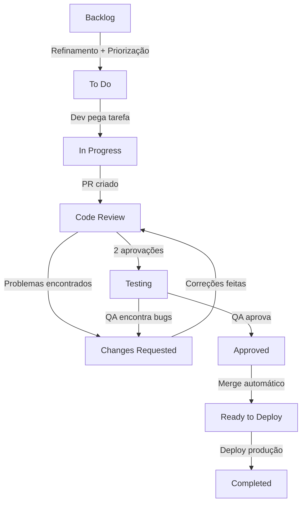

# Task Management - Guia Completo da Berry

## 1. Introdução

### 1.1 Objetivo do Documento

Este documento estabelece o **processo de gerenciamento de tarefas** na Berry, detalhando como tarefas são criadas, estimadas, priorizadas e executadas do início ao fim. O objetivo é garantir fluxo de trabalho padronizado, transparência, qualidade e previsibilidade nas entregas.

### 1.2 Escopo de Aplicação

Este processo se aplica a:

- **Desenvolvedores** (Frontend e Backend): Implementam funcionalidades e corrigem bugs
- **QA**: Validam qualidade das entregas
- **Tech Lead**: Garantem padrões técnicos e arquiteturais
- **Product Owner (PO)**: Definem requisitos e priorizam backlog
- **Project Manager (PM)**: Coordenam fluxo de trabalho e comunicação

### 1.3 Benefícios do Gerenciamento Padronizado

- **Previsibilidade**: Estimativas consistentes permitem planejamento confiável
- **Transparência**: Todos sabem status e prioridades das tarefas
- **Qualidade**: Processo garante revisões e validações em cada etapa
- **Aprendizado**: Retrospectivas identificam melhorias contínuas
- **Redução de Bloqueios**: Prioridades claras evitam gargalos

---

## 2. Sistema de Story Points

### 2.1 O Que São Story Points

**Story Points** são unidades de medida que representam **esforço, complexidade e incerteza** de uma tarefa, não tempo absoluto. Permitem comparar tarefas entre si e prever capacidade do time.

**Importante**: Story points medem **dificuldade relativa**, não horas. Uma tarefa de 3 pontos pode levar 2 horas para um senior e 6 horas para um junior, mas ambos concordam que vale 3 pontos.

### 2.2 Escala Fibonacci Adaptada

Usamos escala Fibonacci modificada: **1, 2, 3, 5, 8, 13**

**Por que Fibonacci?** Números maiores têm gaps maiores, refletindo que quanto maior a tarefa, maior a incerteza.

### 2.3 Tabela de Referência de Pontuação

| Pontos | Esforço | Complexidade | Incerteza | Duração Estimada | Risco |
|--------|---------|--------------|-----------|------------------|-------|
| **1** | Mínimo | Trivial | Nenhuma | Minutos a 1 hora | Muito baixo |
| **2** | Baixo | Simples | Baixa | 1-2 horas | Baixo |
| **3** | Médio | Moderada | Média | Meio dia (2-4 horas) | Médio |
| **5** | Alto | Complexa | Alta | 1 dia (6-8 horas) | Alto |

**Exemplos por pontuação:**

**1 ponto** - Tarefas triviais:
- Ajustar texto de label
- Corrigir typo em documentação
- Adicionar comentário explicativo
- Mudar cor de botão (CSS)

**2 pontos** - Tarefas simples:
- Criar componente de UI reutilizável (shadcn/ui)
- Adicionar validação simples em formulário
- Corrigir bug óbvio com causa conhecida
- Adicionar campo em banco com migration simples

**3 pontos** - Tarefas moderadas:
- Implementar filtro em lista de dados
- Criar endpoint GraphQL CRUD simples
- Adicionar testes unitários para módulo pequeno
- Refatorar função complexa para melhorar legibilidade

**5 pontos** - Tarefas complexas:
- Implementar feature completa (UI + backend + testes)
- Integração com API externa (ex: OpenAI)
- Refatoração de módulo médio
- Implementar fluxo de autenticação OAuth


### 2.4 Regra de Ouro: Tarefas > 5 Pontos Devem Ser Divididas

**Regra absoluta**: Tarefas com **mais de 5 pontos DEVEM ser divididas** em subtarefas menores antes de iniciar desenvolvimento.

**Por quê?**

- Reduz risco de bloqueios prolongados
- Facilita code review (PRs menores)
- Permite entregas incrementais
- Melhora previsibilidade
- Facilita paralelização de trabalho

**Processo de divisão**:

1. Identificar componentes independentes da tarefa
2. Criar subtarefas (parent/child relationship)
3. Cada subtarefa deve ter ≤ 5 pontos
4. Subtarefas devem ser entregáveis individualmente quando possível

> Para organizar branches de subtarefas e merges intermediários, consulte a hierarquia descrita em `git-workflow.md`.

**Exemplo de divisão**:

```markdown
# Tarefa original (13 pontos)
[MAIA-100]: Implementar análise de leads com IA

# Dividida em subtarefas:
[MAIA-101]: (3 pts) Criar schema e migration para armazenar análises
[MAIA-102]: (5 pts) Implementar LeadAnalysisService com integração OpenAI
[MAIA-103]: (3 pts) Criar endpoint GraphQL para análise de leads
[MAIA-104]: (2 pts) Adicionar componente UI para exibir análise
```

### 2.5 Exemplos Práticos de Estimativas

**Cenário 1: Bug Simples**

```markdown
[BRY-123]: Botão de "Salvar" não funciona em formulário de deal

**Análise**:
- Causa conhecida (validação falhando)
- Correção em 1 linha
- Testes já existem

**Pontuação**: 1 ponto
```

**Cenário 2: Feature Moderada**

```markdown
[PROJ-90]: Adicionar filtros avançados na lista de projetos

**Análise**:
- UI: criar componente de filtros (2 pts)
- Backend: adicionar parâmetros no resolver GraphQL (1 pt)
- Testes: adicionar testes de integração (1 pt)
- Total estimado: 4 pontos (não precisa dividir)

**Pontuação**: 3 pontos (ajustado após discussão, considerando que filtros são padrão já usado no projeto)
```

**Cenário 3: Feature Complexa**

```markdown
[DEAL-200]: Implementar sistema de auction para leads

**Análise**:
- Muitas partes: criar auction, bidding, winner selection, payment
- Regras de negócio complexas
- Integrações: Stripe, notificações, events
- Estimativa inicial: 13 pontos

**Decisão**: DIVIDIR em subtarefas

**Pontuação da parent**: 13 pontos (soma das subtarefas)
```

---

## 3. Ciclo de Vida da Tarefa

### 3.1 Visão Geral dos Status

As tarefas na Berry passam pelos seguintes status:

1. **Backlog**: Tarefas não priorizadas ou sem refinamento completo
2. **To Do**: Prontas para serem iniciadas, priorizadas
3. **In Progress**: Em desenvolvimento ativo
4. **Code Review**: Aguardando aprovação de 2 revisores
5. **Changes Requested**: Correções solicitadas por revisores (PRIORIDADE MÁXIMA)
6. **Testing**: QA validando em ambiente temporário
7. **Approved**: QA aprovou, aguardando merge
8. **Ready to Deploy**: Merged em development, aguardando deploy para produção
9. **Completed**: Em produção e validado

### 3.2 Fluxo Completo



### 3.3 Detalhamento de Cada Status

#### 3.3.1 Backlog

**O que é**: Repositório de tarefas não priorizadas ou incompletas.

**Critérios para sair do Backlog**:

- Descrição completa e clara
- Critérios de aceitação definidos
- Story points estimados
- Módulo/área definida (deals, projects, maia, etc)
- Labels apropriadas (bug, feature, refactor, etc)
- Aprovação do PO para entrar em sprint

**Quem move**: Product Owner

**Quando move**: Durante Sprint Planning ou refinamento

#### 3.3.2 To Do

**O que é**: Tarefas prontas para serem iniciadas, priorizadas por ordem de importância.

**Critérios de entrada**:

- Todos os critérios de saída do Backlog atendidos
- Prioridade definida (alta, média, baixa)
- Assignee pode ser definido ou não

**Regras**:

- Desenvolvedores devem respeitar ordem de prioridade
- Antes de iniciar, ler completamente a descrição
- Se algo não está claro, perguntar ao PO **antes** de mover para In Progress
- Tarefas > 5 pontos devem ser divididas **antes** de iniciar

**Quem move**: Desenvolvedor (ao iniciar trabalho)

#### 3.3.3 In Progress

**O que é**: Tarefa em desenvolvimento ativo.

**Regras**:

- **Limite de WIP**: Máximo **1 tarefa In Progress por desenvolvedor**
- Criar branch seguindo padrão: `[ID-DA-TAREFA]` (ex: `MAIA-45`)
- Fazer commits frequentes seguindo padrão do `#git-workflow.md`
- Atualizar progresso nos comentários se tarefa levar > 1 dia
- Se bloqueado, comunicar imediatamente no Slack

**Responsabilidades do desenvolvedor**:

- Implementar conforme critérios de aceitação
- Escrever testes (coverage ≥ 90%)
- Seguir padrões do CLAUDE.md
- Self-review antes de criar PR
- Criar PR assim que implementação estiver completa

**Quando mover para Code Review**:

- Código implementado e testado
- CI/CD pipeline verde
- Self-review completo
- Descrição do PR preenchida (ver `git-workflow.md` e template em `pull-requests.md`)

**Quem move**: Desenvolvedor

#### 3.3.4 Code Review

**O que é**: PR aberto, aguardando aprovação de 2 revisores.

**Prioridade**: **ALTA** - Revisores devem revisar em até **4 horas**

**Critérios para avançar**: 2 aprovações → ambiente temporário criado automaticamente

**Detalhes completos**: Ver [code-review.md](./code-review.md). Template e requisitos de PR estão em `pull-requests.md`; política de merge e rebase em `git-workflow.md`.

#### 3.3.5 Changes Requested

**O que é**: Correções solicitadas por revisores ou QA.

**Prioridade**: **MÁXIMA** - Resolver **imediatamente** (meta: 1 hora)

**Regras críticas**: Prioridade absoluta sobre qualquer outra tarefa. Pausar trabalho em progresso e focar 100% em resolver feedback.

**Quem move**: Desenvolvedor (ao finalizar correções)

#### 3.3.6 Testing (QA)

**O que é**: QA testando funcionalidade em ambiente temporário.

**Critérios de entrada**: 2 aprovações de code review → ambiente temporário criado automaticamente

**Responsabilidades**:
- **QA**: Testar critérios de aceitação, edge cases, reportar bugs claramente
- **Desenvolvedor**: Estar disponível para dúvidas, não iniciar nova tarefa até aprovação

**Quem move**: QA

#### 3.3.7 Approved

**O que é**: QA aprovou, aguardando merge automático.

**O que acontece**:

- Merge automático para `development`
- Branch do PR deletada
- Ambiente temporário destruído
- Tarefa move automaticamente para Ready to Deploy

**Quem move**: Automático

#### 3.3.8 Ready to Deploy

**O que é**: Código merged em development, aguardando deploy para produção.

**Responsabilidade**: Tech Lead

**Processo**:

- Tech Lead valida que todas as tarefas da sprint estão prontas
- Deploy manual para produção (geralmente sexta-feira)
- Após deploy, tasks movem para Completed

**Quem move**: Tech Lead (após deploy)

#### 3.3.9 Completed

**O que é**: Funcionalidade em produção e validada.

**Validação final**:

- QA faz smoke test em produção
- Se bugs críticos encontrados, criar hotfix (FIX-XXX)
- Se tudo OK, tarefa permanece em Completed

---

## 4. Papéis e Responsabilidades

### 4.1 Desenvolvedor (Frontend/Backend)

**Responsabilidades**:
- Estimar tarefas (story points)
- Implementar funcionalidades seguindo CLAUDE.md
- Escrever testes (coverage ≥ 90%)
- Criar PRs completos e bem documentados
- Revisar código (4 horas) e resolver Changes Requested (1 hora)
- Estar disponível durante testes do QA
- Comunicar bloqueios proativamente

**Detalhes sobre code review**: Ver [code-review.md](./code-review.md)

### 4.2 QA

**Responsabilidades**:
- Validar critérios de aceitação
- Testar edge cases e fluxos alternativos
- Reportar bugs claramente (passos, screenshots, severidade)
- Testar em até 24 horas após ambiente disponível
- Re-testar após correções
- Fazer smoke tests em produção

### 4.3 Tech Lead

**Responsabilidades**:
- Garantir aderência aos padrões (CLAUDE.md)
- Revisar PRs críticos ou complexos
- Resolver impasses técnicos
- Mentoria de desenvolvedores
- Coordenar deploys para produção
- Manter qualidade da arquitetura

### 4.4 Product Owner (PO)

**Responsabilidades**:

- Definir e priorizar backlog
- Escrever critérios de aceitação claros
- Esclarecer dúvidas de requisitos
- Participar de Sprint Planning e Review
- Validar se entrega atende expectativa de negócio

**Não faz**:

- Definir solução técnica (responsabilidade do Tech Lead)
- Mudar prioridades no meio da sprint sem motivo
- Adicionar tarefas na sprint em andamento

### 4.5 Project Manager (PM)

**Responsabilidades**:

- Facilitar cerimônias (Planning, Daily, Retro)
- Monitorar progresso da sprint
- Remover impedimentos
- Comunicação com stakeholders
- Garantir que processo está sendo seguido

**Não faz**:

- Definir prioridades técnicas
- Pressionar desenvolvedores por estimativas menores
- Pular etapas do processo

### 4.6 Matriz RACI

| Atividade | Dev | QA | Tech Lead | PO | PM |
|-----------|-----|----|-----------|----|-----|
| Estimar tarefas | R | C | A | I | I |
| Priorizar backlog | C | - | C | R/A | C |
| Implementar código | R/A | - | C | - | I |
| Code review | R/A | - | C | - | I |
| Testar funcionalidade | - | R/A | - | C | I |
| Deploy produção | C | - | R/A | I | I |
| Resolver bloqueios | C | C | C | C | R/A |

**Legenda**:
- **R** (Responsible): Executa a atividade
- **A** (Accountable): Responsável final, aprova
- **C** (Consulted): Consultado, fornece input
- **I** (Informed): Informado sobre decisão

---


## 5. Anatomia de uma Tarefa Bem Definida

### 5.1 Título Claro

**Formato**: `[PREFIXO-XXX]: <tipo>: <descrição curta>`

**Exemplos**:

- `[MAIA-45]: feat: implementa análise de leads com IA`
- `[BRY-123]: fix: corrige erro ao salvar deal`
- `[PROJ-90]: refactor: melhora performance de listagem`

### 5.2 Descrição Completa

**Template**:

```markdown
## Contexto
Por que esta tarefa existe? Qual problema estamos resolvendo?

## Objetivo
O que queremos alcançar com esta tarefa?

## Critérios de Aceitação
- [ ] Critério 1: Específico e testável
- [ ] Critério 2: Específico e testável

## Informações Técnicas (opcional)
- Módulos afetados: deals, maia
- Dependências: integração com OpenAI
- Riscos conhecidos: rate limit da API

## Referências (opcional)
- Figma: [link]
- Tarefa relacionada: #MAIA-40
```

### 5.3 Critérios de Aceitação

Devem ser **SMART** (Específico, Mensurável, Alcançável, Relevante, Testável).

**Bons exemplos**:
✅ "Ao criar lead via formulário, score de 1-5 é calculado automaticamente"
✅ "Filtro por status retorna apenas deals com status selecionados"

**Maus exemplos**:
❌ "Sistema deve ser rápido" (não mensurável)
❌ "Interface deve ser bonita" (subjetivo)

### 5.4 Labels e Tags

**Labels obrigatórias**:
- **Tipo**: `feature`, `bug`, `refactor`, `docs`, `test`
- **Módulo**: `deals`, `projects`, `maia`, `users`, etc
- **Prioridade**: `high`, `medium`, `low`

**Labels opcionais**: `needs-design`, `needs-discussion`, `technical-debt`, `breaking-change`

---


## 6. Perguntas Frequentes (FAQ)

### 6.1 Como estimar tarefas com incerteza?

**Resposta**: Use pontos maiores e considere dividir.

- **Incerteza técnica**: Se não sabemos como fazer, pode ser 8-13 pontos. Considere fazer spike primeiro.
- **Incerteza de requisitos**: Esclarecer com PO antes de estimar.
- **Regra**: Na dúvida, arredondar para cima. Melhor sobrar tempo que faltar.

### 6.2 O que fazer quando tarefa bloqueia?

**Resposta**: Comunicar imediatamente (< 1 hora).

1. Postar no Slack #dev: "Bloqueado em MAIA-45: aguardando API key da OpenAI"
2. Mencionar Tech Lead ou PO
3. Propor solução temporária se possível
4. **Não** iniciar outra tarefa sem autorização

### 6.3 Posso pegar nova tarefa se tenho uma em Code Review?

**Resposta**: 
- **Aguardando aprovação**: Sim, pode pegar nova tarefa
- **Changes Requested**: Não, resolver primeiro (prioridade máxima)
- **Aguardando QA**: Sim, mas fique disponível para dúvidas

### 6.4 Posso mudar estimativa depois de começar?

**Resposta**: Sim, mas comunique. Avisar no Slack e na tarefa, explicar o que mudou, propor nova estimativa. PO decide se continua ou replaneja.

### 6.5 O que fazer se não concordo com estimativa do time?

**Resposta**: Discussão até consenso. Explicar raciocínio, ouvir argumentos, buscar consenso. Se impasse, usar média ou decisão do Tech Lead.

### 6.7 Quantas tarefas devo pegar por sprint?

**Resposta**: Depende dos story points.

- **Desenvolvedores**: ~8-10 pontos por semana (16-20 por sprint de 2 semanas)
- Considerar: code reviews, meetings, imprevistos
- Não se comprometer demais

---